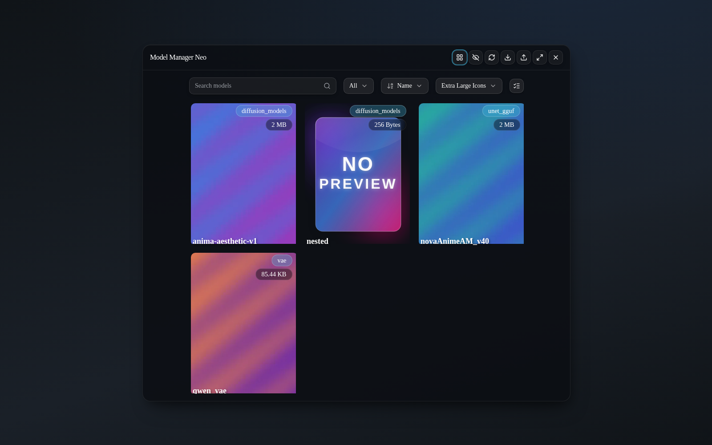
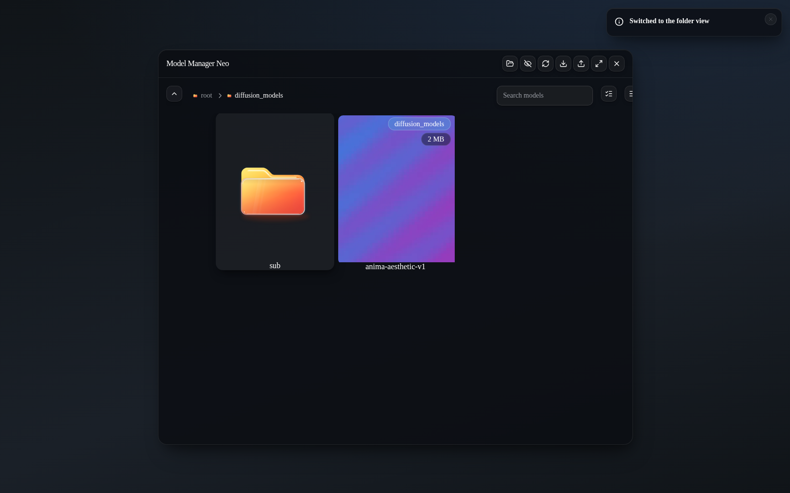
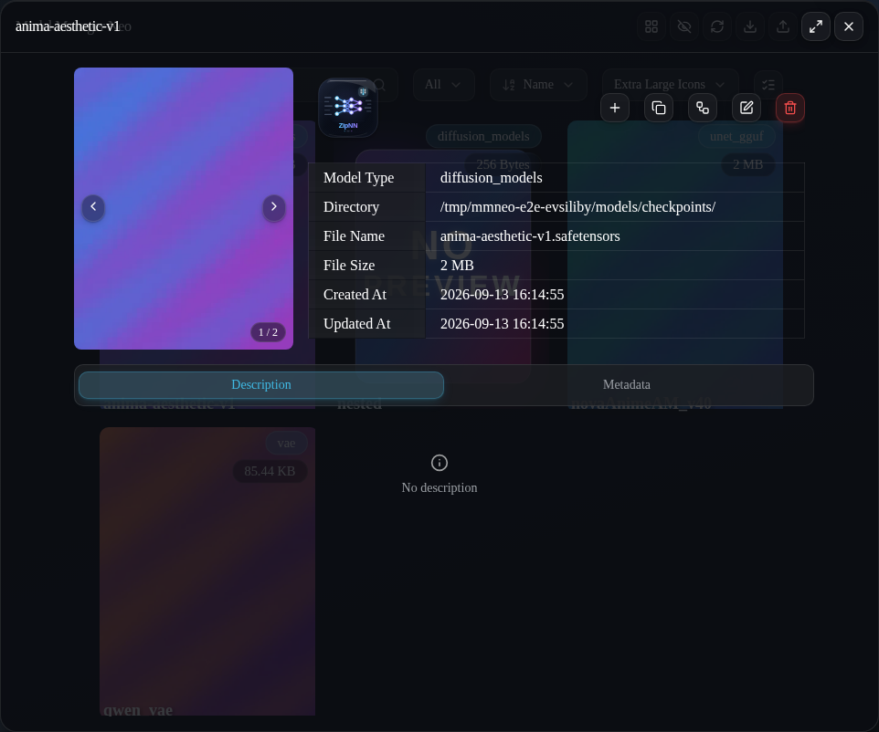
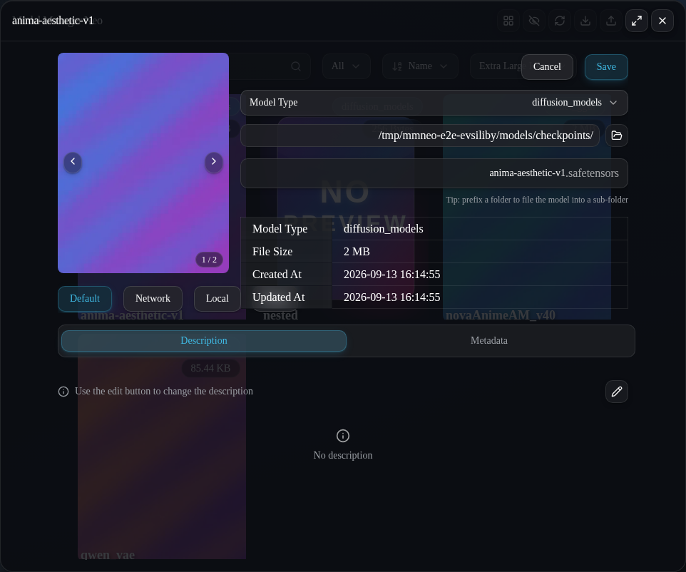
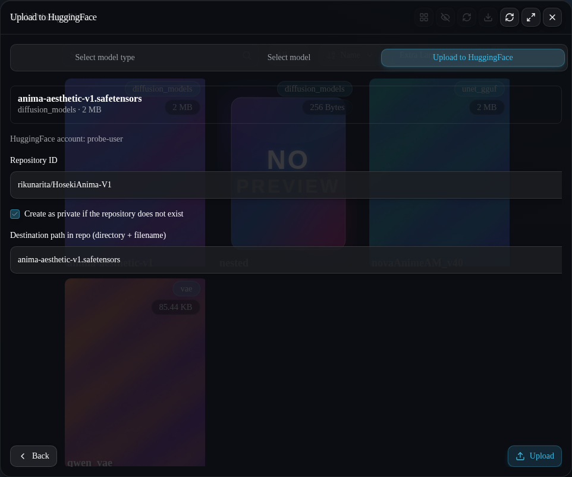
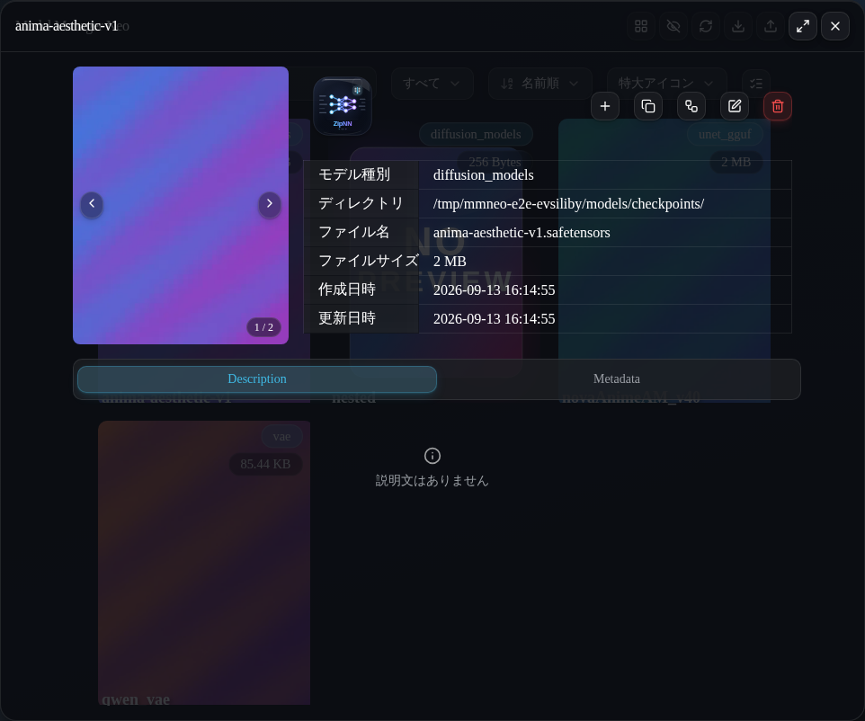

<div align="center">

#  ComfyUI‑Model‑Manager‑Neo

### 閲覧・ダウンロード・アップロード・ドラッグ＆ドロップ — モデルを、美しく管理。

ComfyUI のモデルマネージャーを **Vue 3 + Tailwind CSS v4 + reka‑ui** の上に
再構築した、グラスモフィズムの近代的な再想像。ツールチェーンも完全に現代化しています。


[English](README.md) · **日本語**

<!--
  ┌──────────────────────────────────────────────────────────────────────────┐
  │  SCREENSHOTS                                                             │
  │  以下で参照する画像は `demo-assets/` に同梱されています。             │
  │  ファイルごとのマニフェストと、実働 ComfyUI ウィンドウからの               │
  │  撮り直し手順は demo-assets/README.md を参照してください。           │
  └──────────────────────────────────────────────────────────────────────────┘
-->


</div>

---

**目次**

- [Why Neo?](#why-neo) · [スクリーンショット](#screenshots) · [インストール](#installation) ·
  [機能](#features)
- [モデル検索とマルチプラットフォーム探索](#search) · [ZipNN 可逆圧縮](#zipnn) ·
  [元版からの変更点](#what-changed) · [削除された機能: バッチスキャン](#removed-feature)
- [ドキュメント](#documentation) · [開発](#development) ·
  [クレジットと帰属](#credits) · [ライセンス](#license)

---

<a id="why-neo"></a>

##  Why Neo?

**ComfyUI‑Model‑Manager‑Neo** は優れた元祖マネージャーの経験を引き継ぎながら、
体験を根底から作り直したものです:

-  **グラスモフィズム UI** — 半透明・ぼかし・奥行き（elevation）対応の
  インターフェース。ComfyUI 自身のライト/ダークパレットに自動で追従します。
-  **PrimeVue 不使用** — PrimeVue 依存をまるごと取り除き、軽量でヘッドレスな
  **[reka-ui]** プリミティブ + **Tailwind CSS v4** + **[Lucide]** アイコンへ置換
  （読んで調整できる shadcn‑vue スタイルのコンポーネント群）。
-  **Hugging Face / ModelScope へアップロード** — ローカルモデルを HF リポジトリまたは
  ModelScope のモデルリポジトリへ直接公開（必要ならリポジトリ作成、
  プライベート指定、ライブ進捗表示）。
-  **Rust ネイティブコア** — スキャン・ハッシュ・safetensors ヘッダ解析・
  テンソルツリー・ライブラリ watcher・ZipNN エンジン全体が、リポジトリ同梱の
  **プリビルド Rust 拡張**で動きます（4 プラットフォーム・Stable ABI により
  CPython 3.10+ — コンパイラ不要・pip 不要・ネットワーク不要）。
  純 Python の元実装との実測比較: 5,000 モデルのスキャンが約 7.5 倍、
  5 表記ハッシュが 1 パス、MoE テンソルツリーの描画が約 28 倍、
  ZipNN 圧縮はモデルサイズによらずピーク RAM 1 GB 未満
  （[`docs/BENCH.md`](docs/BENCH.md)）。
-  **ZipNN 可逆圧縮** — safetensors モデルをその場で圧縮/解凍
  （`.znn.safetensors`）、フォルダ単位では封印された `<name>_DeltaZNN`
  バンドルへバッチ圧縮、ファインチューンはベースとの極小**デルタファイル**へ —
  すべて Rust コアが実行し、復元は SHA-256 で検証されます。
-  **複数選択** — モデル/フォルダカードにチェックを入れて、ワークフローへ一括追加、
  または一括削除。
-  **スター** — 全カードのスタートグル。スター済みは常に先頭へ並びます。
-  **フォルダ作成** — フォルダビューの「フォルダを追加」ボタン。
-  **直接リンクダウンロード** — 生の `.safetensors` / `.ckpt` / `.gguf` URL を貼り付け、
  保存先フォルダと任意のサブフォルダを選択できます。
-  **`hf_xet` アクセラレーション** — Hugging Face 転送は、利用可能な場合チャンク分割・
  重複排除された Xet プロトコルを使用します。
-  **第一級のノードグラフ統合** — モデルをキャンバスへドラッグしてノードを
  生成/入力、embedding をテキストエリアへドラッグ、プレビュー画像に埋め込まれた
  ワークフローの読込。
-  **レスポンシブ** — デスクトップ・モバイル・マルチスクリーン環境を想定した設計。
-  **現代的なツールチェーン** — Vite 8 (Rolldown)、TypeScript 6、ESLint 10 flat config、
  Prettier、husky + lint‑staged。決定的で lint クリーンなビルド。

> [!NOTE]
> Neo は [`hayden-cn/ComfyUI-Model-Manager`](https://github.com/hayden-cn/ComfyUI-Model-Manager)
> の**フォーク**であり、同じ **GPL‑3.0** ライセンスで配布されます。
> 元のアーキテクチャに関するすべてのクレジットは原著作者に帰します —
> [クレジット](#credits)を参照してください。

---

<a id="screenshots"></a>

##  スクリーンショット

> [!TIP]
> 以下の画像はすべて [`demo-assets/`](demo-assets/) に同梱されています。
> ファイルごとのマニフェスト
> ([`demo-assets/README.md`](demo-assets/README.md)) には、各ファイルが
> 何を映しているかと、実働 ComfyUI ウィンドウからの撮り直し手順が
> 正確に記されています（ダークテーマ推奨、統一感のため幅 ~1600 px）。

### フラット「モデル」ビュー — 検索・並び替え・グリッドサイズ変更



**フラット**レイアウトのマネージャーウィンドウ: ガラス製のモデルカードのグリッド
（プレビュー・種別とサイズのチップ付き）、検索バー、種別/並び替え/カードサイズの
セレクタ。

### フォルダ（エクスプローラ）ビュー — ディレクトリツリーを辿る



**フォルダ**レイアウトの 1 階層目。ブレッドクラム（各階層に小さなフォルダグリフ。
ルートでは場所を取らず、パスが深くなった分だけ開きます）と、アニメーションする
ガラスのフォルダカード。

### モデル詳細・編集・Hugging Face アップロード

|                                                                                                                 |                                                                                                        |
| --------------------------------------------------------------------------------------------------------------- | ------------------------------------------------------------------------------------------------------ |
|                                                                        |                                                                |
| _モデル情報: プレビュー、基本情報テーブル（**Directory** の末尾 `/` に注目）、Description / Information タブ。_ | _編集モード: 種別ドロップダウン、フォルダピッカーボタン、`folder/name` 接頭辞を受け付けるファイル名。_ |

|                                                                                                |                                                                                         |
| ---------------------------------------------------------------------------------------------- | --------------------------------------------------------------------------------------- |
|                                               |                                            |
| _Hugging Face へアップロード、ステップ 3: リポジトリ ID、作成時プライベート指定、保存先パス。_ | _同じウィンドウの**日本語**表示 — UI は English / 中文 / 日本語 の完全バンドルを同梱。_ |

### モデル名検索と safetensors テンソルツリー

|                                                                                                               |                                                                                                              |
| ------------------------------------------------------------------------------------------------------------- | ------------------------------------------------------------------------------------------------------------ |
|                                                  |                                                                |
| _1 つのクエリで 3 ハブ: Hugging Face / ModelScope / Civitai の列にアバター・ダウンロード数・ディープリンク。_ | _Information タブは safetensors ヘッダを折りたたみ可能なフォルダツリーで描画（Hugging Face ビューア様式）。_ |

10 秒間のツアーは [`demo-assets/hero.gif`](demo-assets/hero.gif)（可逆ソースの
`hero.webm` が同梱）。キャンバスへのドラッグは実働 ComfyUI ウィンドウでのみ
撮れます — 手順は上記マニフェスト参照。

---

<a id="installation"></a>

##  インストール

Neo は ComfyUI のカスタムノードとして動作します。いずれかの方法で:

**1 · Git クローン（アップデート推奨）**

```bash
cd ComfyUI/custom_nodes
git clone https://github.com/rikunarita/ComfyUI-Model-Manager-Neo.git
```

**2 · 手動ダウンロード**

[リポジトリのアーカイブ](https://github.com/rikunarita/ComfyUI-Model-Manager-Neo/archive/refs/heads/main.zip)
をダウンロードして `ComfyUI/custom_nodes/` に展開し、フォルダ名が
`ComfyUI-Model-Manager-Neo` であることを確認してください。

**3 · ComfyUI Manager**

フォークがレジストリへ公開されている場合は、[ComfyUI-Manager] で
**“ComfyUI‑Model‑Manager‑Neo”** を検索してインストールできます。

その後 **ComfyUI を再起動**してください。Python 依存
（`huggingface_hub`・`hf_xet`・`modelscope_hub`・`markdownify`）は初回起動時に
自動インストールされます。ビルド済みの Web バンドルは [`web/`](web)、
ビルド済みの Rust コアは [`native/native-bin/`](native/native-bin) に
同梱されているため、拡張機能の_実行_に Node.js もコンパイラも不要です
（対応プラットフォームは[エンジンの表](#the-engine)参照）。

トップバーの **「Model Manager Neo」** ボタン、サイドバー、または
`Extensions → Model Manager Neo` メニューコマンドから開きます。

> [!TIP]
> Neo は積極開発中です — 日常的に使える完成度ですが、インターフェースは
> まだ進化する可能性があります。フィードバックや Issue を歓迎します。

---

<a id="features"></a>

##  機能

<details open>
<summary><b>閲覧と整理</b></summary>

- 2 つのレイアウト: **フラット**グリッド（既定）と**フォルダ**エクスプローラ。
  いつでも切り替え可能。
- リアルタイム検索（`*` ワイルドカードと複数トークンの AND 一致に対応）。
- 並び替え: 名前 / サイズ / 作成日 / 更新日 / **最近使用**
  （モデルを開くかグラフへ追加すると記録されます）。
- カードサイズ調整（プリセット + 完全カスタム寸法）。
- 隠しファイル（`.` 始まり）の表示/非表示を再起動なしで切替。
- 画像**と動画**のプレビュー、ホバーで開閉アニメーションするガラスの
  フォルダアートワーク、ガラス製のプレビュー欠落フォールバック。
- 種別ルートフォルダカードはその**種別の合計サイズ**を表示
  （軽量な容量ダッシュボード）。記録済み SHA256 がライブラリ内の別ファイルと
  一致するモデルは、詳細ウィンドウに赤い**重複警告**を出します。
- 種別ルートの下へ格納されたモデルカードは、名前の上に**サブディレクトリ**を
  表示します（フラット/フォルダ両ビュー共通）。
- **スマートコレクション** — フラットビューの現在の検索 + 種別フィルタを
  名前付きのユーザー毎コレクションとして保存し、ワンクリックで再適用。
  保存と適用は 1 つのピルボタン `[💾 コレクション ▾]` に集約:
  フロッピー部分が保存ダイアログを開き（独立したクリック/キーボードターゲット）、
  残りが保存済みコレクションの適用/切替メニューを開きます。
- **衛生スキャン** — 孤立プレビュー/ノート・プレビュー欠落モデル・空フォルダを
  探すローカル専用の一斉検査（ネットワーク/ハッシュ計算なし）。
  一括削除はいつもの確認ダイアログ経由です。

</details>

<details>
<summary><b>ノードグラフ統合</b></summary>

- モデルサムネイルをキャンバスへドラッグして**ローダーノードを追加**。
- 既存ノードへドラッグして**一致する入力へ投入**（曖昧な場合は正確に）。
- **embedding** をテキストエリアへドラッグして `(embedding:name:1.0)` を追記。
- プレビュー画像をグラフへドラッグして**埋め込みワークフローを読込**。
- **追加** / **コピー** ボタンでノード配置、または ComfyUI のクリップボードへ複製。

</details>

<details>
<summary><b>ダウンロード</b></summary>

- **Civitai**・**Hugging Face**・**ModelScope**（`www.modelscope.ai`）・
  **直接ファイル** URL を貼り付け。
- Civitai ミラーホスト `civitai.red` のページ URL は **Civitai** と完全に同一扱い
  （保存されるモデルページは貼り付けたホストを維持）。
- ページごとの複数ファイル/バージョンを解決して、欲しいものを選択。
- 直接リンクは明示的な種別指定が必須。任意のカスタムサブフォルダも指定可能。
- 任意のプレビュー画像 — モデルページが提供する**ギャラリー全体**を保持し、
  ダウンロード時に選択されていた画像がカードの第一プレビューに。
  編集モードでギャラリー項目の並べ替え/個別削除が可能。ダウンロード毎に
  編集可能な Markdown 説明も付けられます。
- **空き容量ガード**: ダウンロードダイアログが保存先ボリュームの空き容量を
  表示し、公表サイズが収まらないタスクはバックエンドが拒否。
- タスクの一時停止 / 再開 / 削除。進捗・速度・サイズはライブ更新。
- Hugging Face ダウンロードは `huggingface_hub`（利用可能なら `hf_xet`）を使用。

</details>

<details>
<summary><b>アップロード</b></summary>

- **ローカルファイルから**任意のモデルフォルダへ（Download List にライブ進捗の
  タスクとして登録されます）。
- **Hugging Face / ModelScope へ**: ウィザードの第一段階でプラットフォームを選択
  （各ハブはロゴタイルで表示）。対応するトークンで認証し、リポジトリが
  存在しなければ作成（公開/非公開）、保存先パスを選択、進捗を監視。
  ModelScope は常に国際ドメイン `www.modelscope.ai` へ接続し、そのロゴは他と
  同じく「モデルページを開く」ボタンの背景になります。任意の**関連アセット**
  スイッチで `<モデル名>.*` のサイドカー（プレビュー画像・Markdown ノート）も
  まとめてアップロード — ノートは既定でリポジトリの `README.md` として
  コミットされます。選択した**フォルダ**はフォルダビューの選択バーから
  バッチアップロード（内部の全モデル、サブフォルダ構造保持）。

</details>

<details>
<summary><b>モデル情報とメンテナンス</b></summary>

- ファイル情報を検査し、読み取り専用の **Information** テーブルでモデルに
  記録されたすべてを読めます: ノートの YAML フロントマターを作者・ベース
  モデル・全ハッシュ（`AutoV1` … `SHA256_12`）・形式と精度・モデル
  プラットフォーム・モデルページリンク・全プレビュー URL へ展開
  （未知のキーは末尾にそのまま）。フロントマターの無いモデルは
  safetensors の `__metadata__` ブロックをそのまま表示。
- 名前変更・フォルダ/種別間の移動・プレビューとノートごとの**完全削除**。
  未保存の変更を抱えたキャンセルは先に確認を求めます。
- モデル脇の Markdown ノートを読込・編集・保存。Information テーブル自体も
  明示的な警告の裏側で編集可能（保存時にノートのフロントマターを書き換え）。
- モデルのプレビュー画像を変更/削除 — 編集モードでは青いリングを付けた
  サムネイルが、保存時にカードの第一プレビューへ昇格する画像です。
  タイルのクリックと ‹ / › 矢印でリングを移動。編集に入った時点のリングは、
  閲覧モードがどのページを見ていたかに関わらず常に現在の第一プレビュー
  （閲覧モードのページ送りが第一プレビュー指定を変えることはありません）。
  ギャラリーストリップ末尾の点線タイルでローカル画像ファイルを追加。
- **モデルページを開く**アクションは、モデルの出所ハブ（Civitai /
  Hugging Face / ModelScope）のロゴをボタン背景に着用するため、
  一目で起源を識別できます。
- **ローカルへダウンロード**アクションは保存済みファイルをそのまま
  ブラウザへ添付ファイルとしてストリームし、ライブラリの名前どおりの名前で
  保存されます。詳細アクション行全体（ZipNN・スター・ハブページ・識別・
  グラフアクション・ローカルダウンロード・編集・削除）は 1 つのインライン
  スクロール行の中でボタンサイズを統一しています。
- モデル情報（safetensors メタデータ、safetensors の**テンソル構成**全体を
  畳み込み可能な**フォルダツリー**で（ドット区切りのテンソル名を階層ごとに
  グループ化、階層毎のフォルダアイコン、既定は畳んだ状態、テンソル毎に
  名 / dtype / 形状 — Hugging Face ビューア様式）、Markdown ノート、プレビュー）
  はモデルを開いたときにオンデマンドで読まれます — ライブラリ全体を
  スキャンする別工程はありません。

</details>

<details>
<summary><b>設定と i18n</b></summary>

- **Civitai**・**Hugging Face**・**ModelScope** の API キーは拡張機能脇の
  `private.key` にローカル保存（`CIVITAI_API_KEY` / `HF_TOKEN` /
  `MODELSCOPE_API_TOKEN` 環境変数フォールバック付き）。
  旧バージョンの ComfyUI ユーザー設定に入っていたキーは初回実行時に移行されます。
- モデル種別を一覧から除外。隠しファイルの含む/除く。
- **モデルフォルダの外部変更を監視する**（既定 OFF）— 他プロセスが追加/削除した
  モデルを native のファイル監視（`notify` + 500 ms デバウンス）で検出し、約 1.5 秒で
  該当一覧だけを更新します。ネットワークマウントの root は自動除外、Linux の inotify
  watch 予算が枯渇した場合は定期再取得（30 秒 TTL）へ degrade。状態は
  `GET /model-manager/watch-status` で確認できます。
- **UI のパフォーマンスマークを記録する（K15）**（既定 OFF）— グリッド再計算/描画と
  テンソルツリー構築を `performance.mark` で計測し、コンソールの
  `__mmNeoPerf.summary()` から P50/P95/P99 を読めます（ヘッドレス計測は
  `scripts/bench/front/k15.mjs`、証跡は `docs/BENCH.md` §11）。
- ZipNN 自動化: N 日未使用のモデルを自動圧縮、ダウンロード完了後に自動圧縮、
  prompt 実行中はダウンロードを一時停止。
- UI 言語は ComfyUI のロケールに追従 — **English**・**中文**・**日本語** を
  完全同梱。地域/文字体系サブタグ（`ja-JP`・`zh-Hant-TW` など）は
  基底言語へ畳まれます。

</details>

---

<a id="search"></a>

##  モデル検索とマルチプラットフォーム探索

**ダウンロードタスクを作成**ウィンドウはページ URL 以上を受け付けます:
`https://` で**始まらない**入力はすべてモデル名クエリとして扱われ、
3 プラットフォーム — **Hugging Face**（左列、`huggingface_hub` の
`HfApi.list_models` 経由）・**ModelScope**（中央、`modelscope_hub` 経由）・
**Civitai**（右、公開 REST API）— で並列検索されます。`https://` 接頭辞は
入力中に 1 文字ずつ検査されるため、フィールドは検索モードと URL モードの間を
リアルタイムで行き来します。結果は短いデバウンスの後に更新され、
各列は検索全体を落とさず自身のエラーを個別に報告します。

- すべての結果行は、公開ユーザー/組織の**アバター**を角丸フレームで表示:
  Hugging Face は API（`/api/organizations/{name}` と `/api/users/{name}`）で
  組織と個人のアバターを解決し、ModelScope は
  `GET https://www.modelscope.ai/api/v1/models/{owner}/{repo}` で解決します
  （オーナーの `Organization` ブロックがアバターと表示名を持ちます）。
  ハブが何も公開していない場合はイニシャルバッジ、加えて通算ダウンロード数。
- モデル ID は 2 つのディープリンクに分割: **オーナー名**がユーザー/組織ページ、
  **リポジトリ名**がモデルページを開きます — どちらもホバーで下線、
  クリックでブラウザへ。行のそれ以外をクリックすると、そのモデルが
  ダウンロードエディタへそのまま解決されます。
- 素の **`username/repo-name`** 入力に対応。**Enter は常に一度で解決**:
  結果内の完全一致を優先し、次に裸のリポジトリ ID を Hugging Face リポジトリへ、
  最後に最初の非空列の先頭行へ。結果がまだ無ければ Enter はその場で
  名前検索を実行します。
- すべての列がページ送り対応: 一番下までスクロールすると次ページが存在する
  限り **“∨ さらに表示”** ボタンが現れ、ワンクリックでその列の次ページを追加
  （Hugging Face はダウンロード順オフセット、ModelScope はページ番号、
  Civitai は API 自身のカーソル）。
- プラットフォームは **設定 → Model Manager Neo → 検索** でユーザー毎に
  非表示可能（プラットフォーム毎に 1 つの真偽値）。
- 各プラットフォームの**並び順**も同じ設定項目で選択可能
  （各 API が受け付けるすべての値）。既定は Hugging Face がトレンド順、
  ModelScope が Like 多い順、Civitai が高評価順。

Civitai ダウンロードには、公式 CLI が普及させた安全網がマネージャーのタスク
システムに合わせて組み込まれています:

- **ダウンロード計画（ドライラン）** — 開始前に、エディタが解決済みの保存先パス・
  公表サイズ・公開 SHA256・プラットフォーム API キーの設定状況を表示。
- **SHA256 検証** — 完了した Civitai ダウンロードはハッシュ計算され、公開
  SHA256 と突合。不一致ならファイルを削除してタスクを失敗させます。
- **レイアウトルーティング** — バージョンファイル自身の種別が別のモデル
  フォルダへ対応する場合（同梱 VAE など）、選択中のフォルダではなく
  そのフォルダへ格納。
- **ベースモデル警告** — バージョンのベースモデルが、保存先フォルダの
  ライブラリに記録されたベースモデル群と異なる場合。
- **実行形式フォーマット警告** — pickle / アーカイブペイロードは読込時にコードを
  実行し得ます。エディタはダウンロード前にその旨を伝えます。
- **ハブアカウント（whoami）** — キー設定済みのすべてのプラットフォーム
  （Hugging Face・ModelScope・Civitai）について、ダウンロードダイアログが
  各ハブの whoami エンドポイント経由で接続中アカウントを表示。401 失敗時は
  キーの作成場所と再開方法を正確に案内します。

さらに、Civitai 由来モデルのプレビューを拡大すると、ライトボックスが左に画像・
右に解析済みの**生成メタデータ**（プロンプト・ネガティブプロンプト・サンプラー・
ステップ数・CFG スケール・シード・Clip skip・サイズ・ベースモデル・使用リソース）
を表示します。画像毎に Civitai API から取得されます。

そしてモデル詳細ウィンドウの**ハッシュで識別**は、ローカルファイルがどのモデル
バージョンかを Civitai カタログへ逆引きします: Markdown サイドカーに記録済みの
ハッシュを先に試し、いずれも命中しないときだけファイルを 1 パスでハッシュ計算
（`SHA256` / `AutoV2` / `AutoV1` / `CRC32`、利用可能なら `BLAKE3` も）。
命中すると解決されたモデル/バージョンとベースモデル・トリガーワード・
ファイル一覧、そして公式 CLI が命中時に出力するのと同じ `civitai download`
コマンドを開きます。不一致の場合は、一致するモデルバージョンが
見つからなかった旨を伝えます。

---

<a id="zipnn"></a>

##  ZipNN 可逆圧縮

大容量の `.safetensors` チェックポイントはディスクをすぐに圧迫します。
Neo は [ZipNN](https://github.com/zipnn/zipnn) 形式で、それらを
**その場で・無損失に**圧縮/解凍できます — 公式 ZipNN プロジェクトと同じ
テンソル対応の方式を **純 Rust コア**が実行し、毎 push で公式 `zipnn` 0.5.4
パッケージとのクロス検証が CI で走るため、結果はより広い ZipNN エコシステムと
互換なままです。

### 仕組み

モデルの重みはほとんどが浮動小数点数で、浮動小数点数はほとんどが_冗長_です:
振る舞いの良い重みテンソルの指数部バイトは何度も繰り返されます。ZipNN は
まさにそこを突きます。テンソル毎に:

- 値をバイト平面へ**分割**し、符号/指数/仮数ビットを並べ替えて同種のバイトを
  集めた上で、
- 各平面を FiniteStateEntropy (FSE) コーデックで **Huffman 符号化**します。

浮動小数点_でない_テンソル（整数インデックス、マスクなど）は公式レシピでは
そのままコピーされますが、**Neo の Rust コアはこれらも圧縮します**
（全 safetensors dtype を 2 つの相互運用帯域で — 下記
「dtype カバレッジと相互運用マトリクス」参照）。圧縮後の形が実際には
小さくならないテンソルは、水増しせずに**そのまま**残されます。圧縮された各テンソルは `uint8` ベクタとして格納され、
ファイルはそれらすべての元の `dtype` と `shape` を単一の
`znn_compressed_vectors` メタデータ項目に記録します。何も近似されず、
何も捨てられません — 解凍は元ファイルを**ビット単位で**再現します。

圧縮済みモデルは元の隣へ `<name>.znn.safetensors` として書かれます —
公式 ZipNN ツール（および `zipnn_safetensors()` パッチ済みローダー）が
期待する正確な接尾辞なので、パッチ済み ComfyUI ローダーは Neo が圧縮した
モデルを透過的に読めます。現実的なチェックポイントは通常元のサイズの
**60〜80 %** 程度に収まります（ランダム寄りのデータはあまり縮みません。
低エントロピーの重みはもっと縮みます）。

### dtype カバレッジと相互運用マトリクス

Rust コアは **safetensors 0.8 が定義する全 22 dtype** を圧縮します。
帯域は 2 つあり、圧縮ファイルの
帯域はメタデータ（拡張帯は `znn_neo_extended="1"`）に記録され、UI にも
表示されます: Information タブの **Neo 拡張**バッジ、圧縮方式行
（dtype 内訳集計 `bfloat16×412, uint8×3, …`）、そして圧縮確認ダイアログの
明示文です。

| テンソル dtype                                                                                                                  | ZipNN dtype コード    | 公式 ZipNN 0.5.4 ツール                                                                                       |
| ------------------------------------------------------------------------------------------------------------------------------- | --------------------- | ------------------------------------------------------------------------------------------------------------- |
| `F32` `F16` `BF16` `F8_E4M3` `F8_E5M2`                                                                                          | 1–30（上流互換帯）    | **Neo のファイルをそのまま解码可能**                                                                          |
| `F64` `C64` `I8` `U8` `BOOL` `I16` `U16` `I32` `U32` `I64` `U64` `F8_E4M3FNUZ` `F8_E5M2FNUZ` `F8_E8M0` `F4` `F6_E2M3` `F6_E3M2` | 128–146（Neo 拡張帯） | **明示エラーで拒否**（静かな破損は起きない — pip 版実ビルド against で CI が実証、`scripts/l5` セクション E） |

知っておくべき詳細:

- 公式デコーダは未実装の dtype コードを全て
  `ValueError: Unsupported Dtype N` で拒否します — Neo 拡張ファイルを
  上流ツールが誤って解码することは構造上あり得ません。Neo 内では他の
  ファイルと同様、SHA‑256 検証付きで byte‑exact に復元されます;
- `complex64` は上流 enum が code 9 を予約しているにもかかわらず
  **Neo 帯（code 130）**を使います: 公式 0.5.4 デコーダには code 9 の
  分岐が**存在せず**、Neo コードと全く同じように拒否されることが実証
  済みです（ソース読解ではなく実機テスト — L5 セクション E2）。つまり
  互換になるべき相手がいません;
- 上位バイトがゼロの整数テンソル（`int32` の 65536 未満のインデックス・
  マスク・スケール表など）はさらに**トランケーション モード**を使い、
  全ゼロのバイト平面をペイロードから丸ごと落とします。圧縮側が
  「テンソル全体でゼロ」であることを検証した平面のみを落とすため、
  構造的に可逆です;
- `complex128`/`bcomplex32` はコーデック級（code 129/131）に存在しますが
  safetensors 表現がないため、`.safetensors` ファイルに含まれることは
  ありません。

### 使い方

任意の `.safetensors` モデルを開きます。プレビューと情報テーブルの間の隙間に
**ZipNN アートワークそのものがボタン**として置かれています — 同梱 SVG は
自前のガラス盤（ダークモード版含む）を描画し、ホバーで浮き上がり+明るく、
ツールチップとスクリーンリーダーへ自らを説明します。押すと:

1. 意図して “Danger” 風に**しない**確認を求めます（圧縮は可逆で、圧縮ファイルが
   完全に書き込まれ検証されるまで元を決して削除しません）。
2. 作業中、ボタンは**ライブ進捗バー**に置き換わります（Rust コアが
   mmap でストリーム処理し GIL を解放するため、ComfyUI の残りは応答性のまま）。
3. 成功すると元を `<name>.znn.safetensors` へ入れ替え — プレビューと
   Markdown ノートもリネームに追従し、グリッドは自動更新されます。

**圧縮済み**モデルを開くと、同じアートワークが色を**反転**させ、アクションは
_解凍_へ反転。同じ確認の上で plain な `.safetensors` を復元します。
情報テーブルも変わります: _ファイルサイズ_ の 1 行が **元のファイルサイズ** /
**圧縮後ファイルサイズ** / **元サイズ比** に置き換わります — 圧縮前のサイズは
圧縮時にファイルのメタデータへ記録されるため、内訳はリネーム後も生き残ります
（そのキーを書かない公式 ZipNN CLI で圧縮されたファイルは、そのまま
_ファイルサイズ_ の 1 行を維持します）。

同じアートワークは**すべてのモデル/フォルダカードの右上**（スタートグルの隣）
にもあります: ワンクリックで（反転表示なら解凍を）モデルを開かずに圧縮でき、
確認は同一です。タスク実行中 — 単独・バッチ・デルタのいずれでも — ボタンは
**円形の進捗リング**（バッチは円内にパーセント）を表示します。

### バッチ圧縮（フォルダ単位）

ZipNN の公式ツールはパスごと圧縮できます。Neo はそれをマネージャーへ
組み込みました。フォルダを選択（「ファイルを選択」）して**下部バーの ZipNN
アートワークボタン**を押す — かフォルダカードのコーナーボタンを使う — と、
フォルダツリー内のすべての `.safetensors` モデルが圧縮され（プレビューと
ノートも追従）、**バンドルフォルダ `<name>_DeltaZNN` へ移動**します —
空になった元フォルダは消滅します。`*_DeltaZNN` バンドルは封印されています:

- 内部に置けるのは ZipNN の内容物（`*.znn.*` モデル・`*.znn` デルタファイル）
  のみ（プレーンモデルのアップロード・ダウンロード・移動は拒否）。
- バンドルフォルダと非バンドルフォルダの同時選択は不可 — バンドル側は
  警告トーストとともに自動で選択解除されます。
- バンドルの ZipNN ボタンは**反転**。押すと**バッチ解凍**し、中身すべてを
  名前の元になったフォルダへ戻します（空になったバンドルフォルダは削除）。
- デルタフォルダ（`<base>_DeltaZNN`、後述）もバンドルです: 反転ボタンが
  内部のファインチューンすべてを一度に復元します。
- モデル種別の**ルートフォルダ**（`checkpoints` など）はバンドルを
  **自分の中に**作ります（`<root>_DeltaZNN`）— 種別ルートの兄弟は ComfyUI の
  フォルダ対応から外れ、ローダーからもマネージャーからも消えてしまうため。
  方向は自動判定: プレーンモデルが残っていれば圧縮、バンドルのみなら解凍。
- 旧バージョンが作ったバンドル（`<name>_ZNN`）も引き続き認識され、
  元の名前へ解凍されます。

複数フォルダはキューとして実行: 確認は 1 回、タスクは順番に、
進捗状態は一度に 1 つ。

### デルタ圧縮（ベースに対するファインチューン）

ファインチューン済みモデルはベースと大部分のバイトを共有するため、ZipNN は
**差分だけ**を保存できます: plain な `.safetensors` モデルをちょうど 2 件選択して
下部バーの **ZipNN デルタ圧縮**を押します。小さなダイアログで、どちらが
**ベース**でどちらがファインチューンかを選択（公式のバイトレベルデルタ API を
ヘッダ長合わせ付きで使用しているため、ベースとファインチューンが異なる
メタデータを持っていても構いません）。結果 — 通常はファインチューンサイズの
数パーセント — は **`<base>_DeltaZNN/<ft>_delta_<base>.znn`** へ書かれ、
冗長なファインチューンファイルは削除されます。デルタの解凍（そのカード
ボタン、反転表示）はファインチューン済みモデルをベースの隣へ**バイト完全
一致**で復元し、空になったデルタフォルダを廃止します。復元にはベースモデルが
必要で、ZipNN はデルタ作成時に両側のバイト長が同じことを検証します。

<a id="the-engine"></a>

### エンジン: プリビルドの純 Rust コア

圧縮機は公式の Python パッケージでは**ありません**: `zipnn` の C 拡張は
PyPI に Linux ホイールが無いため、`pip install zipnn` はソースビルドされ、
C ツールチェーンと Python ヘッダの無いマシンでは必ず失敗します。Neo は
代わりに形式を Rust へ移植し（[`native/crates/znn-codec`](native/crates/znn-codec)、
`unsafe` ゼロ・ファジング済み）、**プリビルドの abi3 バイナリ**を
リポジトリに同梱します — プラットフォーム毎に 1 本、`import` だけで
ロードされます:

| プラットフォーム               | 成果物                                        | 要件                                      |
| ------------------------------ | --------------------------------------------- | ----------------------------------------- |
| Linux x86_64                   | `native-bin/linux-x86_64/mm_core.abi3.so`     | glibc ≥ 2.28（Debian 10 / Ubuntu 20.04+） |
| Linux aarch64                  | `native-bin/linux-aarch64/mm_core.abi3.so`    | glibc ≥ 2.28                              |
| macOS（Intel & Apple Silicon） | `native-bin/macos-universal2/mm_core.abi3.so` | fat バイナリ 1 本、macOS 11+              |
| Windows x86_64                 | `native-bin/windows-x86_64/mm_core.pyd`       | MSVC ビルド                               |

各プラットフォームで 1 本が **CPython 3.10 以降の全バージョン**をカバーします
（Stable ABI・`abi3-py310` — CI が 3.10 と 3.13 で実証）。サイズは CI ゲートで
1 本 ≤ 5 MB（合計 ≤ 20 MB）に制限されます。相互運用は約束ではなく CI ゲート
です: `integration` ワークフローが毎 push で**公式 pip `zipnn` 0.5.4** と
クロス検証します（Neo の圧縮ファイルが公式で解凍でき、その逆も成立 —
`scripts/l5`）。ライセンス: 形式移植は ZipNN（MIT）と FiniteStateEntropy
（BSD-2）へ帰属し、プレビュー WebP codec は zenwebp（AGPL-3.0）を使用 —
全文は [`native/NOTICE`](native/NOTICE) 参照。

バイナリの無いプラットフォーム（他のアーキテクチャ・32 bit・特殊な libc）でも
インストール自体は機能します: 閲覧・ダウンロード・ハッシュは純 Python 経路へ
デグレードし、ZipNN 操作とプレビュー再エンコードはサイレントに失敗せず
ローダーの正確な理由を報告します。

> [!NOTE]
> 圧縮は mmap でストリーム処理されるため、ピーク RAM はモデル全体ではなく
> 概ね最大単一テンソル程度です（12 GB のチェックポイントでも 1 GB 未満）。
> **無損失・検証付き**です: コアは圧縮時に元の SHA-256 を記録し、復元時に
> 再検証します（不一致時は圧縮ファイルを保持し、出力を調査用に `.corrupt`
> として退避）。plain な `.safetensors` は `.znn.safetensors` が書き込まれ
> 検証された後の atomic rename を経て初めて削除され、失敗した実行は
> 途中生成物を片付けます。

---

<a id="what-changed"></a>

##  元版からの変更点

このセクションは GPL‑3.0 ライセンスが求めるとおり、フォークの差分を明示します。
機能は保存され、拡張されました。_削除_されたものは 2 つ: PrimeVue 依存そのものと、
バッチスキャン機能 — [削除された機能: バッチスキャン](#removed-feature)を参照。

###  インターフェース

| 領域                     | 元版                                                      | **Neo**                                                                                                                                                                                                                                                       |
| ------------------------ | --------------------------------------------------------- | ------------------------------------------------------------------------------------------------------------------------------------------------------------------------------------------------------------------------------------------------------------- |
| コンポーネントライブラリ | PrimeVue 4                                                | **reka‑ui**（ヘッドレス）+ shadcn‑vue スタイルのラッパー                                                                                                                                                                                                      |
| スタイリング             | Tailwind CSS v3 + PrimeVue テーマ                         | スコープ付き `--mm-*` デザイントークンによる **Tailwind CSS v4**                                                                                                                                                                                              |
| アイコン                 | PrimeIcons                                                | アイコンマップ経由の **Lucide**（`@lucide/vue`）                                                                                                                                                                                                              |
| 見た目と操作感           | 標準的な PrimeVue サーフェス                              | **グラスモフィズム**（ぼかし・奥行き・マイクロインタラクション）、自動ダークモード                                                                                                                                                                            |
| ダイアログ               | PrimeVue `Dialog` / `ContextMenu`                         | reka‑ui ダイアログ、ダイアログ毎のサイズ/位置、ドラッグ移動、アンカー付きコンテキストメニュー                                                                                                                                                                 |
| モデル詳細タブ           | Description + Metadata（生の safetensors `__metadata__`） | Description + **Information**: ノートの YAML フロントマター（作者・ベースモデル・ハッシュ・形式と精度・モデルプラットフォーム・モデルページリンク・全プレビュー URL・未知キーはそのまま）を解析する読み取り専用テーブル。生の `__metadata__` はフォールバック |

###  バックエンドとエンジン

最も深い変更は UI の下にあります。元版は純 Python ですが、Neo はすべての
ホットパスをプリビルドの Rust 拡張（`native/`、PyO3 / Stable ABI —
[エンジンの表](#the-engine)参照）へ移し、Python フォールバックは
「エラーよりデグレードが正しい」経路のみに残しています:

| 領域               | 元版                                              | **Neo**                                                                                                                                                     |
| ------------------ | ------------------------------------------------- | ----------------------------------------------------------------------------------------------------------------------------------------------------------- |
| モデル一覧         | リクエスト毎の Python `os.walk`                   | Rust 並列ウォーク + 永続フロントマターインデックス（5,000 モデル: コールド ~7.5 倍・ウォーム ~100 ms。エントリ単位のゴールデンテスト済み）                  |
| ハッシュ           | `hashlib` SHA-256 の 1 ループ                     | 5 表記（`SHA256`/`AutoV1`/`AutoV2`/`CRC32`/`BLAKE3`）を**1 パス**のストリーミングで同時計算                                                                 |
| ダウンロード検証   | 完了後のフル再読込                                | 書込ループが供給するインラインダイジェスト — 追加 I/O ゼロ — で Civitai SHA-256 ゲートを維持                                                                |
| safetensors ヘッダ | `comfy.utils` + `json.loads`                      | Rust jiter 解析を 1 ルートへ集約（metadata + tensors + 事前グループ化された表示ツリー。MoE ヘッダで ~28 倍・JS 側と wire フォーマットのクロスチェック付き） |
| ZipNN 圧縮         | —                                                 | エンジン全体: 圧縮/解凍/フォルダバッチ/ファインチューン差分。mmap ストリーム（どんなモデルでも RAM < 1 GB）・SHA-256 検証付き復元・協調キャンセル API       |
| プレビュー         | PIL 再エンコード。アニメは先頭フレームへ固定化    | zenwebp（純 Rust）encode/decode。アニメ GIF/WebP は**アニメのまま**（フレーム・duration・loop・ICC を保持）                                                 |
| ハブ HTTP          | スレッドプールワーカー内のブロッキング `requests` | イベントループ上の共有 `aiohttp` セッション 1 本（止まった CDN がワーカーを 120 s read timeout 分専有できない）                                             |
| フォルダ監視       | —                                                 | 任意の native `notify` watcher（既定 OFF）: 種別単位 ~1.5 s 更新、ネットワークマウントは自動スキップ、inotify 枯渇は 30 s TTL へデグレード                  |
| ライブラリ衛生     | —                                                 | 孤児サイドカー/空フォルダの一掃 + 一括クリーンアップ                                                                                                        |

元版に対する機能面の追加（HF/ModelScope アップロード、マルチハブ検索、
ハッシュ identify、コレクション、スター、複数選択、フォルダ作成、直接リンク
ダウンロード、空き容量ガード、Civitai ダウンロードの安全網、ギャラリー
プレビュー、日本語ロケール）は [機能](#features) に記載のとおりで、
すべて Neo 側の実装です。

###  パッケージ

- **削除:** `primevue`・`@primevue/themes`・`lodash`・`dayjs`・`js-yaml`。
- **追加/置換:** `reka-ui`・`@lucide/vue`・`es-toolkit`（← lodash）・
  `date-fns`（← dayjs）・`yaml`（← js-yaml）・`vue-sonner`（トースト）・
  `class-variance-authority`・`clsx`・`tailwind-merge`。
- **アップグレード:** Vite 5 → **8** (Rolldown)、TypeScript 5 → **6**、
  Vue i18n 9 → **11**、markdown‑it 14 → **15**、`@vueuse/core` 11 → **15**。
- **Python:** `huggingface_hub` + `hf_xet` + `modelscope_hub` を追加（元版の
  requirements は `markdownify` のみ）。旧スレッドプールの代わりに asyncio
  タスクプール。ブロッキング `requests` を全廃した共有 aiohttp クライアント。
- **Rust:** `native/` ワークスペース（`znn-codec` 形式コア + `mm-core` PyO3
  バインディング）を追加し、プリビルド abi3 バイナリとして同梱 — 拡張機能
  自体はコンパイル済み Python パッケージを一切インストールしません。

###  ツールバー/ボタンの役割

マネージャーヘッダーは、アイコンで明示するアクション群へ再設計されました:
**フラット ⇄ フォルダレイアウト切替**・**衛生スキャン**・**隠しファイル表示/非表示**・
**更新**・**ダウンロード一覧**・**Hugging Face / ModelScope へアップロード**。

###  ガラスアセットパック（フォルダアイコンとNO‑PREVIEW アート）

インターフェースは `assets/` の手作りグラスモフィズムアセットパックを活用します:

- **フォルダカード**は静止時に `Folder-Icons/close-folder_beside-fit.svg` を表示。
  カードへポインタを**1 秒以上**置くと `folder-opening-animation.svg` が再生され
  （SMIL モーフ: 0.2 s 遅延 + 1.35 s）、1 秒以上離れ続けると
  `folder-closing-animation.svg` が再生された後、静止アイコンへ戻ります。
  すれ違っただけでフォルダがパタパタすることはありません。SVG はバンドルへ
  インライン化されるため（`?raw` + data URI）、すべてのカードが自前の SVG 文書を
  持ちます: 追加リクエスト無し、アートワーク内部の gradient id が画面上の多数の
  カード間で衝突することも決してありません。
- **ブレッドクラム**は全セグメントへ小さな `close-folder_all-fit.svg` グリフ
  （14 px）を前置 — 小さいサイズで最も読みやすい変種です。
- **プレビューの無いモデル**はガラス製の `NOPREVIEW-Icon/NO-PREVIEW.svg` を
  既定アートワークとして使用: モデル一覧は
  `GET /model-manager/no-preview.svg` を直接指します（`image/svg+xml` として
  そのまま配信 — ベクタアートは決してラスタライズされません）。
  プレビュー ルートは実プレビューファイルを配信するか 404 で答えます。
- **モデルハブロゴ**は `AIModelHub-Logos/` にあります
  （`civitai-icon.svg`・`hf-icon.svg`）: **モデルページを開く**ボタンは、
  ノート（`website`）に記録されたプラットフォームのロゴを背景に着用します。
  詳細アクション行でもカードのホバー列でも同様です。

###  ツールチェーン

lint / format パイプラインは、フロントエンド向けに**ESLint 10 flat config** +
**Prettier** + **Stylelint 17**、Python バックエンド向けに **Ruff** + **mypy** を
備えた、慣習的で完全に設定済みの構成です。さらに**dependency‑cruiser**
（import グラフゲート）と、デッドコード/重複解析のための
[Fallow](https://fallow.tools) で補完されます（[開発](#development)を参照）。
Rust ワークスペースは `clippy -D warnings` + `rustfmt` で運用し、5 層の
テストピラミッド（単体テスト・ゴールデン差分・**cargo-fuzz** 7 ターゲット
〔週次 3 h/本〕・3 OS での実成果物に対する pytest フルスイート・公式
`zipnn` クロス検証）で守られます（[開発](#development)を参照）。

---

<a id="removed-feature"></a>

##  削除された機能: バッチスキャン

**「モデル情報バッチスキャン」**機能は削除されました。冗長だったためです:
モデル詳細ウィンドウは、そのモデルの `__metadata__` を safetensors ヘッダから
直接読み、ファイル脇の Markdown ノートも併せて表示し、プレビューの無いモデルは
グリッド内で同梱のガラス製 `NO-PREVIEW.svg` アートワークを着けます。
全モデルをハッシュ計算して Civitai へハッシュ問い合わせるライブラリ全体の
walk は、同じ情報へ至る第二の、ずっと遅い経路でした — 加えてモーダル
ダイアログ・グローバルストア・websocket イベント・ディスク上のタスクファイル・
専用設定まで抱え、すべて維持する必要がありました。

スキャンより長生きした 2 つの設定は、今日では**モデル一覧**を駆動しています
（どの種別をグリッドへ読むか、`.` 始まりファイルを表示するか）。設定カテゴリは
**Model List** です。歴史的な `ModelManager.Scan.*` の ID 文字列は維持しています —
この ID こそが ComfyUI がユーザー毎の値を永続化するキーだからです。
改名すれば、既存環境すべての保存済み設定が孤立してしまいます。

> [!NOTE]
> **これにより諦めるもの:** ファイルハッシュで Civitai からプレビューと説明を
> _一括後付け_する唯一の手段。情報が未取得だったモデルは、プレビュー/ノートを
> 手で設定する（エディタのギャラリーストリップ）か、プレビューを持つ
> _ダウンロードタスクを作成_ で再ダウンロードするまで、プレースホルダの
> プレビューを維持します。モデル情報の読み取りは影響を受けません —
> 常にディスクから、要求込みで読まれます。個々のモデルは詳細ウィンドウの
> ハッシュ逆引きで Civitai カタログと随時照合できます。

<a id="documentation"></a>

##  ドキュメント

手順形の使い方ガイド。それぞれ単体で完結しています:

- [`docs/USAGE-EN.md`](docs/USAGE-EN.md) — English
- [`docs/USAGE-JA.md`](docs/USAGE-JA.md) — 日本語
- [`docs/USAGE-ZN.md`](docs/USAGE-ZN.md) — 中文

インストール、両レイアウト、カード操作とグラフへのドラッグ、モデルエディタ
（フォルダピッカー・フォルダ接頭辞名・プレビュー・説明）、ダウンロードと
タスク一覧、ハブアップロード（Hugging Face / ModelScope）の各フェーズと
完了メッセージ、ZipNN 圧縮、設定とロケール、さらにトラブルシューティング表
までを扱います。埋め込まれているスクリーンショットは
[`demo-assets/`](demo-assets/) にあり、ファイル毎のマニフェストは
[`demo-assets/README.md`](demo-assets/README.md) にあります。

<a id="development"></a>

##  開発

Web バンドルの**ビルド**にのみ Node.js が必要です。ComfyUI 内での拡張機能の
実行には Python だけあれば足ります（コアはプリビルドで同梱）。

```bash
corepack enable          # ピン留めされた pnpm 版を使います（Node 26）
pnpm install
uv sync --frozen         # Python 開発/テスト環境（.venv）
```

Python バックエンドの開発/テスト環境（pytest・ruff・mypy・各 hub SDK・torch‑CPU）は
**[uv]** で管理します — `uv sync --frozen` が `pyproject.toml` の
`[dependency-groups]` とコミット済み `uv.lock` から一括で再構築します。
これは開発/CI の便宜のみで、**ランタイム契約は不変**です —
ComfyUI は引き続き初回起動時に `requirements.txt` を自前でインストールします
（2 つのリストの一致はテストでピン留めされています）。

Rust コアの開発には stable ツールチェーンだけで足ります — debug ビルドで
正式な `mm_core` です（API ハンドシェークと pytest フルスイートの挙動は
release と同一）:

```bash
cd native && cargo build -p mm-core
cp target/debug/libmm_core.so native-bin/linux-x86_64/mm_core.abi3.so   # 自機のタグへ
```

`scripts/build-native.sh --target <tag> --size-gate` が出荷用 release 成果物を
再現します（glibc ≥ 2.28 床は zigbuild、macOS universal2 は maturin + lipo）。
ワークスペース・テストピラミッド・ファジングの詳細は
[`native/README.md`](native/README.md) 参照。

| スクリプト                            | 用途                                                                        |
| ------------------------------------- | --------------------------------------------------------------------------- |
| `pnpm dev`                            | Vite 開発サーバ（ComfyUI でのホットリロード用 `web/manager-dev.js` を書込） |
| `pnpm build`                          | `web/` へのプロダクションビルド                                             |
| `pnpm build:clean`                    | `web/` を削除してから再ビルド                                               |
| `pnpm rebuild`                        | `node_modules/` と `web/` を削除、再インストール、再ビルド                  |
| `pnpm typecheck`                      | `vue-tsc --noEmit` 型チェック                                               |
| `pnpm lint` / `pnpm lint:fix`         | ESLint（flat config）                                                       |
| `pnpm lint:css` / `pnpm lint:css:fix` | Stylelint 17（CSS + Vue SFC の style ブロック、Tailwind v4 対応）           |
| `pnpm deps`                           | dependency-cruiser: import グラフゲート（Node ≥ 22 が必要）                 |
| `pnpm deps:graph`                     | モジュールグラフの `dependency_graph.svg` を書込                            |
| `pnpm format` / `pnpm format:check`   | Prettier（Tailwind プラグイン入り）                                         |
| `pnpm py:lint` (`:fix`)               | バックエンドの Ruff lint（`py/`・`__init__.py`）                            |
| `pnpm py:format` (`:check`)           | バックエンドの Ruff format                                                  |
| `pnpm py:test`                        | pytest スイート（`mm_core` 未ビルド時は native 系テストが skip）            |
| `python -m mypy`                      | バックエンドの静的型検査（pyproject の `[tool.mypy]`）。クリーン            |
| `pnpm rs:fmt` (`:check`) / `rs:lint`  | `native/` の rustfmt / clippy `-D warnings`                                 |
| `pnpm rs:test`                        | Rust 単体 + 統合テスト（mm-core は extension-module 無しで）                |
| `pnpm rs:build`                       | `mm-core` の release ビルド                                                 |
| `pnpm fallow`                         | Fallow フルパイプライン: デッドコード + 重複 + ヘルススコア                 |
| `pnpm fallow:dead` (`:type-aware`)    | 未使用ファイル/export/型/依存・循環 — 任意の TS セマンティックパス          |
| `pnpm fallow:dupes`                   | AST クローン検出（`mild` モード、`.fallowrc.json` 参照）                    |
| `pnpm fallow:health`                  | 複雑度ホットスポット・リファクタ対象・0〜100 のヘルススコア                 |
| `pnpm fallow:fix:dry` / `fallow:fix`  | 自動クリーンアップのプレビュー / 適用（必ず先に dry-run を）                |
| `pnpm fallow:audit`                   | PR 形式ゲート: 現在の変更が導入した指摘のみ                                 |

> [!WARNING]
> `pnpm dev` は `manager-dev.js` を書く前に **`web/` ディレクトリ全体を削除**
> します（`vite.config.ts` の `dev()` プラグイン参照）。これはコミット済みの
> プロダクションバンドル — `web/manager.js` と `web/style-*.css` — を作業ツリーから
> 消すため、`git status` はそれらを削除済みとして表示します。その状態でコミット
> すると、UI が二度と読まれない拡張機能を出荷してしまいます。コミット前は必ず
> `pnpm build` を実行し、`web/manager.js` の無いツリーを決してコミットしないで
> ください。

**husky** の `pre-commit` フックがステージ済みファイルへ **lint-staged** を
実行します: フロントエンドは ESLint + Stylelint + Prettier、バックエンドは
Ruff（lint + format）。

### Fallow（コードベース知能）

[Fallow](https://fallow.tools)（Rust 製、解析器に AI 不使用）が linter 群を
補完します: リポジトリを 1 つの依存グラフとして読み、未使用の
ファイル/export/型/依存・循環 import・クローングループ・複雑度ホットスポットを
報告します。`.fallowrc.json` はエントリポイント（`src/main.ts`）をピン留めし、
コミット済み `web/` バンドル・docs・assets をグラフから外し、private 型漏洩と
未解決 import の検査をオンにします。ツリーは**未使用 export ゼロ・重複ゼロ**に
保たれています（`pnpm fallow:fix:dry` は `pnpm fallow:fix` が適用する前に、
すべての自動削除をプレビューします）。CI はこの不変条件を強制します: `ci.yml` の
`Dead code & duplication (fallow)` ステップが `pnpm fallow:dead` +
`pnpm fallow:dupes` を実行し、その ERROR レベルのルール
（`unused-exports` / `unused-files` / `unresolved-imports`）がビルドを失敗させます。

### Lint & format スタック

ESLint 10 flat config が `typescript-eslint`・`eslint-plugin-vue`
（`vue-eslint-parser` 経由）・`eslint-plugin-import-x`（エイリアス対応の import
順序）・`eslint-plugin-tailwindcss`（クラス衛生）・`eslint-config-prettier`
（必ず最後に置くこと）を結びつけます。Prettier は書式と Tailwind クラスの
並び順を `prettier-plugin-tailwindcss` 経由で担当します。

**Stylelint 17**（`stylelint-config-standard`）は `src/style.css` とすべての SFC
style ブロックを検査します（`postcss-html` / `postcss-less` 経由）。Tailwind v4 の
at-rule（`@theme`・`@source`・`@custom-variant` など）は許可リスト入りしており、
Safari が `backdrop-filter` / `appearance` にまだ必要とする `-webkit-` 接頭辞は
意図して残しています。`@import` は文字列表記を維持します
（`@import 'tailwindcss/theme.css'`）: これが
`prettier-plugin-tailwindcss` がクラス並び替えのために解決する形です —
`url()` 形は黙って既定順へ劣化します — また oklch 色は標準の
パーセント/角度表記を使います。

**dependency-cruiser 18**（`pnpm deps`、Node ≥ 22）は `src/` の_import グラフ_を
ゲートします: 循環無し・孤児無し・未解決無し・出荷コードからの devDependency /
Node コア import 無し。`pnpm deps:graph` がグラフを SVG へ描画します。

**Ruff**（`pyproject.toml` の `[tool.ruff]`）はバックエンドの linter かつ
フォーマッタです（target `py310`、行長 120、選りすぐりのルールセット:
pyflakes・bugbear・pyupgrade・comprehensions・returns・Ruff 独自の async/dict
検査・import 整序。`E402` と `SIM105` は意図して無視 — ComfyUI のエントリ順は
意味を持ち、防御的な `try/except: pass` ガードは `contextlib.suppress` より
ここで読むには明快です）。上に重ねて **mypy** が静的型を検査します。

### プロジェクト構成

```
├─ __init__.py            # ComfyUI エントリ: 依存導入・ルート登録
├─ py/                    # Python バックエンド（aiohttp ルート、タスク、ハブクライアント）
│  ├─ manager.py          #   モデル CRUD + native 加速の一覧/衛生スキャン
│  ├─ download.py         #   ダウンロードタスク（http + huggingface_hub + modelscope_hub）
│  ├─ upload.py           #   ローカルファイルアップロード（パス検証済み）
│  ├─ upload_hf.py        #   Hugging Face へアップロード（共有ハブパイプライン）
│  ├─ upload_modelscope.py#   ModelScope へアップロード
│  ├─ compress.py         #   native ジョブ API を駆動する ZipNN ルート
│  ├─ information.py      #   Civitai/HF/ModelScope ページ解決・プレビュー配信
│  ├─ search.py           #   マルチプラットフォームのモデル名検索 + アバタープロキシ
│  ├─ identify.py         #   Civitai ハッシュ逆引き
│  ├─ native.py           #   プリビルドコアのローダー（プラットフォームタグ・API ハンドシェーク）
│  ├─ http_client.py      #   全ハブ通信の共有 aiohttp セッション
│  ├─ watcher.py          #   任意のライブラリ watcher（native notify・既定 OFF）
│  ├─ auth.py · config.py · thread.py · utils.py
├─ native/                # Rust ワークスペース（GPL-3.0・帰属は native/NOTICE）
│  ├─ crates/znn-codec/   #   ZipNN 形式コア + scan/hash/header/webp（+ fuzz/）
│  ├─ crates/mm-core/     #   PyO3 abi3 バインディング（mm_core モジュール）
│  └─ native-bin/         #   プラットフォームタグ別のプリビルドバイナリ（main へコミット）
├─ src/                   # Vue 3 フロントエンド
│  ├─ components/         #   アプリコンポーネント + ui/（reka-ui ラッパー）
│  ├─ hooks/              #   store・models・download・zipnn・upload・config など
│  ├─ utils/ · types/ · locales/
│  ├─ style.css           #   Tailwind v4 エントリ + デザイントークン
│  └─ main.ts             #   ComfyUI 拡張を登録
├─ scripts/               # KPI ベンチ（証跡は docs/BENCH.md）+ L5 クロス検証
├─ tests/                 # pytest スイート: ゴールデン契約・parity・接合部
└─ web/                   # ComfyUI へ配信するビルド済みバンドル（コミット済み）
```

---

<a id="credits"></a>

##  クレジットと帰属

ComfyUI‑Model‑Manager‑Neo が存在するのは、
**[hayden‑cn](https://github.com/hayden-cn)** 氏の
**[`ComfyUI-Model-Manager`](https://github.com/hayden-cn/ComfyUI-Model-Manager)** が
先に存在したからこそです。このフォークの構造的アイデアのすべて —
モデルフォルダ抽象、websocket 進捗プロトコルを備えた再開可能なダウンロード
タスクシステム、Civitai / Hugging Face ページパーサ、カードをグラフへ
ドラッグする統合、モデルエディタのフォーム配管、カードサイズプリセット
といった細かなアフォーダンスに至るまで — hayden‑cn 氏の設計です。Neo は
皮膚と依存を変え、数多くのバグを直しました。_胴体_そのものを
発明する必要はなかったのです。元版を読むことは、このコードベースがなぜこの形をしている
のかを理解する最速の道であり、アーキテクチャに対する誠実な帰属は:
**彼らのもの**です。

本フォークは **GNU General Public License v3.0** に従って使用・改変された
派生物です。Neo における改変（UI 再構築、PrimeVue 除去、Rust ネイティブコア、
ZipNN 圧縮、HF/ModelScope アップロード、マルチハブ検索とハッシュ identify、
パッケージ現代化、ツールチェーン、信頼性とセキュリティの強化、バッチスキャン
削除、日本語ローカライズ — 項目別の一覧は[元版からの変更点](#what-changed)）は
同じ GPL‑3.0 ライセンスで提供されます。ライセンスに従い、原著作者の著作権表示と
ライセンス全文は [`LICENSE`](LICENSE) に保持されています。

###  Built with Qwen Studio

このフォークの大部分は **[Qwen Studio]** とともに作られました: ZipNN エンジン
（形式の `unsafe` ゼロ Rust 移植・ファズスイート・プリビルド abi3 配布）、
グラスモフィズム UI 再構築、各ハブのアップロードフロー、信頼性とセキュリティの
各パス、そしてデバッグの多くが、その密接な協働で開発されました。

このフォークがあなたの役に立つなら、星は上流リポジトリへお願いします。

以下の優れたプロジェクトとともに作られています: [reka-ui]・[Tailwind CSS]・
[Lucide]・[VueUse]・[es-toolkit]・[vue-sonner]・[huggingface_hub]・[hf_xet]・
[modelscope_hub]・[ZipNN]・[zenwebp]。

---

<a id="license"></a>

##  ライセンス

**GPL‑3.0‑only** — 全文は [`LICENSE`](LICENSE) を参照。

Rust ネイティブコア（[`native/`](native/)）は、プレビュー WebP パイプラインのため
**[zenwebp]**（純 Rust の WebP codec・**AGPL‑3.0‑only** OR Imazen 商用
デュアルライセンス）を静的リンクします。Neo は GPL‑3.0‑only で、
zenwebp を **AGPL‑3.0** 条件で利用します。法的根拠: AGPLv3 §13 は AGPL 成果物と
GPLv3 成果物の結合を明示的に許可します（AGPL 部分は AGPL のまま）。ComfyUI は
**ローカルアプリ**（ネットワークサービスではない）のため AGPL のネットワーク条項は
実質無作用で、配布時のソース入手可能性義務はこの公開リポジトリで充足されます。
ネイティブコアの第三者帰属の全文は [`native/NOTICE`](native/NOTICE) を参照。

<div align="center">

**Neo があなたの時間を節約したら、リポジトリへ星を 、そして
[原著作者](https://github.com/hayden-cn/ComfyUI-Model-Manager)へ感謝を。**

</div>

<!-- Link references -->

[reka-ui]: https://reka-ui.com
[Tailwind CSS]: https://tailwindcss.com
[Lucide]: https://lucide.dev
[VueUse]: https://vueuse.org
[es-toolkit]: https://es-toolkit.dev
[vue-sonner]: https://vue-sonner.vercel.app
[huggingface_hub]: https://github.com/huggingface/huggingface_hub
[hf_xet]: https://github.com/huggingface/xet-core
[modelscope_hub]: https://github.com/modelscope/modelscope_hub
[ZipNN]: https://github.com/zipnn/zipnn
[zenwebp]: https://github.com/imazen/zenwebp
[uv]: https://docs.astral.sh/uv/
[Qwen Studio]: https://chat.qwen.ai/
[ComfyUI-Manager]: https://github.com/ltdrdata/ComfyUI-Manager
