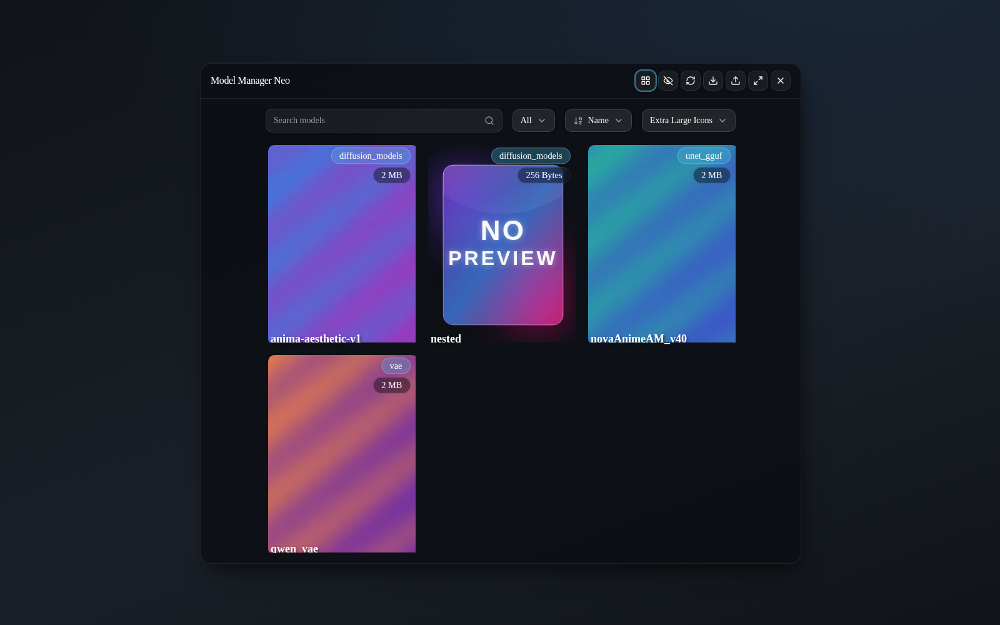
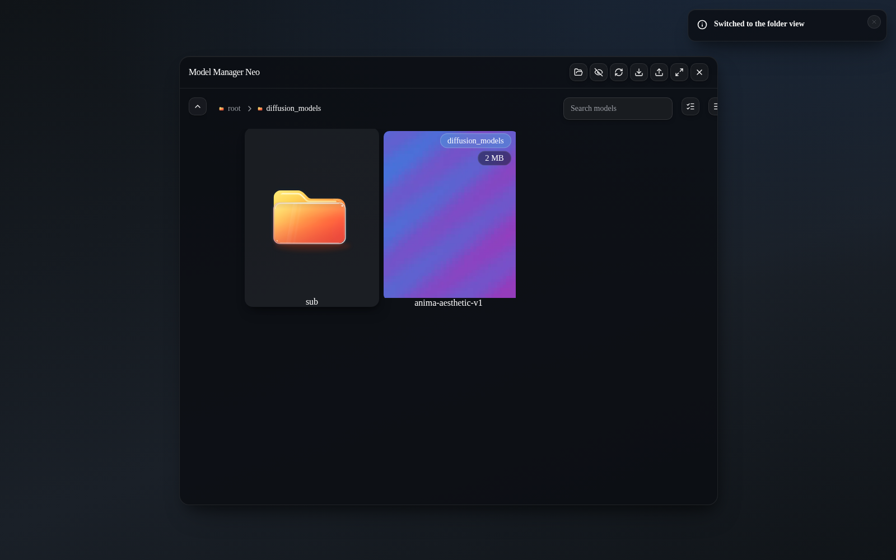

<div align="center">

#  ComfyUI‑Model‑Manager‑Neo

### Browse · Download · Upload · Drag‑and‑drop — your models, beautifully managed.

A modern, glassmorphism re‑imagining of the ComfyUI model manager, rebuilt on
**Vue 3 + Tailwind CSS v4 + reka‑ui** with a fully modern toolchain.


<!--
  ┌──────────────────────────────────────────────────────────────────────────┐
  │  IMAGES TO PREPARE (this fork intentionally ships NO upstream images)    │
  │  Create a `docs/screenshots/` folder and drop the files listed below.      │
  │  Each placeholder in this README already points at its final path, so the  │
  │  picture appears automatically once you add the file. Suggested capture:   │
  │  a real ComfyUI window running this extension, dark theme, ~1600px wide.   │
  │                                                                            │
  │    1. docs/screenshots/hero.gif            – 8‑10s looping overview        │
  │    2. docs/screenshots/view-flat.png       – Flat "Models" grid            │
  │    3. docs/screenshots/view-folders.png    – Folder (explorer) view        │
  │    4. docs/screenshots/node-graph.gif      – drag a card onto the canvas   │
  │    5. docs/screenshots/download.png        – Create Download Task dialog   │
  │    6. docs/screenshots/hf-upload.png       – Upload to HuggingFace dialog  │
  │    7. docs/screenshots/model-info.png      – Model info (preview + tabs)   │
  │    8. docs/screenshots/settings.png        – ComfyUI settings (API keys)   │
  └──────────────────────────────────────────────────────────────────────────┘
-->


</div>

---

**Contents**

- [Why Neo?](#why-neo) · [Screenshots](#screenshots) · [Installation](#installation) ·
  [Features](#features)
- [What changed from the original](#what-changed) · [Removed feature: batch scan](#removed-feature)
- [First reliability pass](#pass-1) · [Second reliability pass](#pass-2) ·
  [Third reliability pass](#pass-3) · [Fourth reliability pass](#pass-4) ·
  [Fifth reliability pass](#pass-5)
- [Development](#development) · [Credits & Attribution](#credits) · [License](#license)

---

<a id="why-neo"></a>

##  Why Neo?

**ComfyUI‑Model‑Manager‑Neo** takes the excellent original manager and rebuilds
the experience from the ground up:

-  **Glassmorphism UI** — a translucent, blurred, elevation‑aware interface
  that follows ComfyUI's own light/dark palette automatically.
-  **PrimeVue‑free** — the entire PrimeVue dependency was removed and replaced
  with lightweight, headless **[reka-ui]** primitives + **Tailwind CSS v4** +
  **[Lucide]** icons (shadcn‑vue style components you can read and tweak).
-  **Upload to Hugging Face** — publish any local model straight to a HF repo
  (creates the repo if needed, private option, live progress) — _new in Neo_.
-  **Direct‑link downloads** — paste a raw `.safetensors`/`.ckpt`/`.gguf` URL,
  pick the target folder, optionally choose a custom sub‑folder.
-  **`hf_xet` acceleration** — Hugging Face transfers use the chunked,
  deduplicated Xet protocol when available.
-  **First‑class node‑graph integration** — drag a model onto the canvas to
  spawn or fill a node, drag embeddings into text areas, load workflows embedded
  in preview images.
-  **Responsive** — designed for desktop, mobile and multi‑screen setups.
-  **Modern toolchain** — Vite 8 (Rolldown), TypeScript 6, ESLint 10 flat
  config, Prettier, husky + lint‑staged. Deterministic, lint‑clean builds.

> [!NOTE]
> Neo is a **fork** of [`hayden-cn/ComfyUI-Model-Manager`](https://github.com/hayden-cn/ComfyUI-Model-Manager)
> and is distributed under the same **GPL‑3.0** license. All credit for the
> original architecture belongs to its author — see [Credits](#credits).

---

<a id="screenshots"></a>

##  Screenshots

> [!TIP]
> The images below are **placeholders**. Prepare the files listed in the
> `docs/screenshots/` checklist at the top of this README and they will render
> automatically. Capture them from a live ComfyUI instance running this
> extension (dark theme recommended, ~1600 px wide for consistency).

### Flat “Models” view — search, sort and resize the grid



_What to capture:_ the manager dialog in **Flat** layout showing a grid of model
cards with previews, the search bar, and the type / sort / card‑size selectors.

### Folder (explorer) view — navigate your directory tree



_What to capture:_ the **Folder** layout with the breadcrumb trail and folder
cards, ideally one level deep inside a model type.

### Drag a model straight onto the graph


_What to capture:_ a 4–6 s clip dragging a model card from the manager onto the
ComfyUI canvas, spawning a loader node with the model already selected.

---

<a id="installation"></a>

##  Installation

Neo runs as a ComfyUI custom node. Pick one method:

**1 · Git clone (recommended for updates)**

```bash
cd ComfyUI/custom_nodes
git clone https://github.com/rikunarita/ComfyUI-Model-Manager-Neo.git
```

**2 · Manual download**

Download the
[repository archive](https://github.com/rikunarita/ComfyUI-Model-Manager-Neo/archive/refs/heads/main.zip),
extract it into `ComfyUI/custom_nodes/`, and make sure the folder is named
`ComfyUI-Model-Manager-Neo`.

**3 · ComfyUI Manager**

If the fork is published to the registry, search for
**“ComfyUI‑Model‑Manager‑Neo”** in [ComfyUI-Manager] and install it from there.

Then **restart ComfyUI**. Python dependencies (`huggingface_hub`, `hf_xet`,
`markdownify`) are installed automatically on first launch. The prebuilt web
bundle ships in [`web/`](web), so no Node.js is required to _run_ the extension.

Open it from the top‑bar **“Model Manager Neo”** button, the sidebar, or the
`Extensions → Model Manager Neo` menu command.

> [!TIP]
> Neo is under active development — functional and daily‑drivable, but the
> interfaces may still evolve. Feedback and issues are welcome.

---

<a id="features"></a>

##  Features

<details open>
<summary><b>Browse &amp; organise</b></summary>

- Two layouts: **Flat** grid and **Folder** explorer, switchable at any time.
- Real‑time search (supports `*` wildcards and multi‑token “AND” matching).
- Sort by name, size, date created or date modified.
- Adjustable card size (presets + fully custom dimensions).
- Toggle visibility of hidden (`.`‑prefixed) files without restarting.
- Image **and video** previews, plus glass folder artwork with hover
  open/close animations and a glass no‑preview fallback.

</details>

<details>
<summary><b>Node graph integration</b></summary>

- Drag a model thumbnail onto the canvas to **add a loader node**.
- Drag onto an existing node to **fill a matching input** (exact when ambiguous).
- Drag an **embedding** into a text area to append `(embedding:name:1.0)`.
- Drag a preview image onto the graph to **load an embedded workflow**.
- **Add** / **Copy** buttons to place a node or copy it to ComfyUI's clipboard.

</details>

<details>
<summary><b>Download</b></summary>

- Paste a **Civitai**, **Hugging Face** or **direct file** URL.
- Resolve multiple files/versions per page and pick the one you want.
- Direct links require an explicit target type, with an optional custom
  sub‑folder.
- Optional preview image and editable Markdown description per download.
- Pause / resume / delete tasks; progress, speed and size update live.
- Hugging Face downloads use `huggingface_hub` (+ `hf_xet` when available).

</details>

<details>
<summary><b>Upload</b></summary>

- **From local file** into any model folder (registered as a live task with
  progress in the Download List).
- **To Hugging Face** _(new in Neo)_: authenticated via your HF token, creates
  the repository if it doesn't exist (public/private), choose the destination
  path, and watch progress.

</details>

<details>
<summary><b>Model info &amp; maintenance</b></summary>

- Inspect file info and safetensors metadata.
- Rename, move between folders/types, or **permanently delete** a model together
  with its previews and notes.
- Read, edit and save Markdown notes stored beside the model.
- Change or remove a model's preview image.
- Model information (safetensors metadata, Markdown notes, preview) is loaded on
  demand when a model is opened — there is no separate library‑wide scan step.

</details>

<details>
<summary><b>Settings &amp; i18n</b></summary>

- API keys for **Civitai** and **Hugging Face**, stored locally in `private.key`
  (with `CIVITAI_API_KEY` / `HF_TOKEN` environment fallbacks). Keys migrate out
  of ComfyUI user settings on first run.
- Exclude model types from the model list; include/exclude hidden files.
- UI language follows ComfyUI's locale — **English** and **中文** bundled.

</details>

---

<a id="what-changed"></a>

##  What changed from the original

This section makes the fork's differences explicit, as required by the GPL‑3.0
license. Functionality is preserved and extended. Two things were _removed_: the
PrimeVue dependency itself, and the batch‑scan feature — see
[Removed feature: batch scan](#removed-feature).

###  Interface

| Area              | Original                         | **Neo**                                                                         |
| ----------------- | -------------------------------- | ------------------------------------------------------------------------------- |
| Component library | PrimeVue 4                       | **reka‑ui** (headless) + shadcn‑vue‑style wrappers                              |
| Styling           | Tailwind CSS v3 + PrimeVue theme | **Tailwind CSS v4** with scoped `--mm-*` design tokens                          |
| Icons             | PrimeIcons                       | **Lucide** (`@lucide/vue`) via an icon map                                      |
| Look & feel       | Standard PrimeVue surfaces       | **Glassmorphism** (blur, elevation, micro‑interactions), auto dark mode         |
| Dialogs           | PrimeVue `Dialog`/`ContextMenu`  | reka‑ui dialogs, per‑dialog size/position, drag‑to‑move, anchored context menus |

###  Packages

- **Removed:** `primevue`, `@primevue/themes`, `lodash`, `dayjs`, `js-yaml`.
- **Added / replaced:** `reka-ui`, `@lucide/vue`, `es-toolkit` (← lodash),
  `date-fns` (← dayjs), `yaml` (← js-yaml), `valibot` (runtime schema
  validation), `vue-sonner` (toasts), `class-variance-authority`, `clsx`,
  `tailwind-merge`, `tw-animate-css`.
- **Upgraded:** Vite 5 → **8** (Rolldown), TypeScript 5 → **6**, Vue i18n 9 →
  **11**, markdown‑it 14 → **15**, `@vueuse/core` 11 → **14**.
- **Python:** added `huggingface_hub` + `hf_xet`; asyncio task pool replacing the
  old thread pool.

###  Toolbar / button roles

The manager header was redesigned into explicit, icon‑driven actions:
**flat ⇄ folder layout toggle**, **show/hide hidden files**, **refresh**,
**download list**, and **upload to Hugging Face**.

###  Glass asset pack (folder icons & no‑preview art)

The interface draws on a hand‑made glassmorphism asset pack in `assets/`:

- **Folder cards** show `Folder-Icons/close-folder_beside-fit.svg` at rest.
  Hovering a card plays `folder-opening-animation.svg` (SMIL morph: 0.2 s
  delay + 1.35 s), unhovering plays `folder-closing-animation.svg`, and the
  card then settles back onto the static icon. The SVGs are inlined into the
  bundle (`?raw` + data URI), so every card owns its SVG document: no extra
  requests, and the gradient ids inside the artwork can never collide
  between the many cards on screen.
- **Breadcrumb trails** prefix every segment with the tiny
  `close-folder_all-fit.svg` glyph (14 px) — the variant that reads best at
  small sizes.
- **Models without a preview** fall back to the glass
  `NOPREVIEW-Icon/NO-PREVIEW.svg` artwork, served verbatim as
  `image/svg+xml` (vector art is never rasterised), replacing the old flat
  `no-preview.png` raster.

###  Toolchain

Biome was trialled and then **removed** in favour of a conventional,
fully‑configured **ESLint 10 flat config** + **Prettier** pipeline (see
[Development](#development)).

---

<a id="removed-feature"></a>

##  Removed feature: batch scan

The **“Batch scan model information”** feature has been **removed entirely**. It
was redundant: opening a model already loads, on demand and for exactly the model
you are looking at, everything the scan used to backfill in bulk.

- `DialogModelDetail` requests `GET /model-manager/model/{type}/{index}/{filename}`
  as soon as it mounts. That returns the model's `__metadata__` (read straight
  from the safetensors header) and the Markdown notes stored beside the file.
- The preview is served by `GET /model-manager/preview/{type}/{index}/{filename}`,
  which resolves whichever preview file exists (`.webp` / `.png` / `.jpg` / video,
  as `name.ext` or `name.preview.ext`) and otherwise falls back to the bundled
  placeholder.

A library‑wide walk that hashed every model and queried Civitai by hash was a
second, far slower route to the same information — plus a modal dialog, a global
store, two websocket events, a task file on disk and its own settings, all of
which had to be maintained. All of it is gone.

**Frontend**

- Deleted `src/components/DialogScanning.vue` and `src/hooks/scan.ts`.
- `App.vue`: removed the `scanning` toolbar button, `openModelScanning()` and the
  `DialogScanning` import; `utils/iconMap.ts`: removed the
  `mdi mdi-folder-search-outline` mapping and its `FolderSearch` import.
- Dropped ten scan‑only keys from `en.json` / `zh.json`
  (`batchScanModelInformation`, `modelInformationScanning`, `scanModelInformation`,
  `selectedAllPaths`, `scanFullInformation`, `scanMissInformation`,
  `scanCompleted`, `scanCompletedWithErrors`, `setting.scanAll`,
  `setting.scanMissing`).

**Backend**

- `py/information.py`: removed the `GET` and `POST /model-manager/model-info/scan`
  routes, `create_scan_model_info_task`, `download_model_info`,
  `get_scan_model_info_task_list`, `get_scan_information_task_filepath`,
  `SCAN_TASK_ID` and the scan's own `DownloadThreadPool` (along with the now
  unused `functools` / `thread` imports).
- Removed `ModelSearcher.search_by_hash` and its three implementations — the scan
  was the only caller. `_resolve_model_type` stays: `search_by_url` uses it.
- `py/utils.py`: removed `recursive_search_files` and `calculate_sha256` (and the
  `hashlib` import) — both existed only for the scan.
- The `update_scan_information_task` / `complete_scan_information_task` websocket
  events no longer exist, and no `downloads/scan_information.task` file is written.

**Deliberately kept** — these say “scan” but are _not_ part of the batch scan:

- `ModelManager.Scan.excludeScanTypes` and `ModelManager.Scan.IncludeHiddenFiles`
  drive the **model list** (which types are loaded into the grid, and whether
  `.`‑prefixed files are shown) and the toolbar's show/hide‑hidden‑files toggle.
  **These two setting ID strings are intentionally unchanged**: the ID is the key
  ComfyUI persists the user's value under, so renaming it would silently orphan
  every existing installation's saved setting. A harness assertion now pins all
  seven IDs so they cannot drift.
- Everything _around_ those IDs was still de‑scan‑ned, because none of it is
  persisted: the settings category is now **Model List** (was “Scan”), the label
  is **“Exclude model types (separate with commas)”** (was “Exclude scan types”),
  the i18n keys are `setting.modelList` / `setting.excludeModelTypes`, the
  TypeScript identifier is `configSetting.excludeModelTypes`, and the backend
  setting group in `py/config.py` is `model_list` (so `manager.py` now resolves
  `model_list.include_hidden_files`). Verified end to end: with
  `IncludeHiddenFiles` off the list is `[alpha, beta, gamma]`, with it on
  `[.hidden, alpha, beta, gamma]`.
- `ModelManager.scan_models()` / `os.scandir` — builds the model **list** (“scan”
  here means “enumerate a folder”, as it did upstream). Left as‑is on purpose:
  renaming it would churn code that has nothing to do with the removed feature.
- `scan_model_download_task_list()` — lists **download tasks**. Same reasoning.
- Tailwind's “source scan” wording in `src/style.css` — unrelated.
- `ui/tree`, `ui/progress`, `useModelFolder`, and the `selectModelType` /
  `selectSubdirectory` / `selectedSpecialPath` / `noModelsInCurrentPath` strings —
  shared with the Upload and Hugging Face Upload dialogs and the model editor.

> [!NOTE]
> **What this gives up:** the only way to _bulk backfill_ previews and
> descriptions from Civitai by file hash. A model whose information was never
> fetched keeps its placeholder preview until the preview/notes are set by hand
> (model editor → **Preview** → _Network_ / _Local_), or until it is re‑downloaded
> through _Create Download Task_, which does carry a preview. Reading a model's
> information is unaffected — that always came from disk, on demand.

<a id="pass-1"></a>

##  First reliability pass (Tailwind layers, dialog stack, Python hardening)

Neo was audited end‑to‑end and hardened. Highlights:

**Frontend**

- Restored the Tailwind **theme layer** so standard utilities (`p-*`, `text-*`,
  `size-*`, `gap-*`, …) are actually emitted — previously every theme‑dependent
  class was silently dropped from the stylesheet.
- Excluded build output from Tailwind's source scan → **deterministic** CSS
  (no more “garbage” utilities pulled from the bundled `web/manager.js`).
- Rebuilt the dialog stack to honour **per‑dialog** `defaultSize`, `min/max`
  sizes, `resizeAllow` and `modal`; non‑modal by default again so the canvas
  stays interactive (drag‑to‑graph works); dialogs no longer close on
  Escape/outside click; header drag‑to‑move restored.
- Fixed the flat grid crash on first paint (`chunk()` with a non‑positive column
  count), the “None” preview not deleting existing previews, custom sub‑folders
  being dropped/doubled on download, the embedding drag inserting the file
  _extension_ instead of the name, an unanchored right‑click menu, the
  indeterminate progress bar, and several icon/i18n gaps.
- `<GlobalLoading/>` is rendered again (the global spinner was dead).

**Backend (Python)**

- **Critical:** removed `hf_hub_download(resume_download=…)`, deleted in
  `huggingface_hub` 1.x — every Hugging Face download was failing with a
  `TypeError`.
- Persist the joined sub‑folder into the task so completed downloads land in the
  chosen folder (not the type root).
- Correct progress payloads, recursive HF file‑tree sizes, HF `tree`/`blob` URL
  filtering, preview URL construction, and Python 3.13‑safe `mimetypes` usage.
- `is_installed()` now parses requirement specifiers, so pip no longer re‑runs on
  every startup.
- **Security:** local uploads validate the target path (blocks arbitrary writes
  and path traversal); model paths are traversal‑checked.

All changes preserve existing behaviour and are covered by the checks in
[Development](#development).

---

<a id="pass-2"></a>

##  Second reliability pass (progress slot, model editor, task pool)

A second end‑to‑end audit — driven by a headless harness that runs the real
`web/manager.js` bundle against the real Python routes over HTTP + WebSocket —
found and fixed the following. Nothing here changes intended behaviour; each
item restores behaviour that was documented but silently broken.

**Blocking I/O in request handlers**

- **`GET /models/{folder}` blocked the event loop** — every model list refresh
  stat'ed every file inline. Moved to the executor, with the request‑scoped
  hidden‑files setting resolved beforehand.

**Model editor**

- **Every `<Button>` defaulted to `type="submit"`.** reka‑ui's `Primitive` does
  not add a type, and the HTML default is `submit`; PrimeVue's Button injects
  `type="button"`. Inside `ModelContent`'s `<form>` that meant each icon button
  submitted the form — pressing the pencil set `editable = true` and then
  immediately ran the save handler, which set it back to `false`. **The model
  editor could not be opened at all.** `Button` now defaults to `type="button"`
  (explicit `type="submit"`/`"reset"` still win). The same latent hazard was
  removed from the hand‑written `<button>` elements that can end up inside that
  form (`ResponseInput`'s clear button, `ModelPreview`'s carousel arrows) and,
  for hygiene, from `ResponseBreadcrumb` / `DownloadTaskItem`.
- **Entering edit mode erased the model type.** A `watch(editable, …)` that
  upstream never had reset `type` to `''`, so saving a move/rename sent
  `type: ""` and the backend rejected it, and the Create Download Task dialog
  lost the type resolved from the search.
- **Renaming and moving a model were silently ignored.** `updateModel` only
  compared `subFolder` and `pathIndex`, so changing just the file name — or the
  model _type_ at the same path index — sent no request at all; the editor
  simply closed as if the change had been saved. All five fields are compared
  now, and a move across types refreshes both folders.
- **Civitai model types are resolved again.** `_resolve_model_type` had been
  deleted and the type hardcoded to `""`. It is restored, hardened to only
  return a type ComfyUI actually has a folder for (so categories such as
  "Wildcards" degrade to empty instead of an unusable value).

**Layout & task pool**

- **The folder view broke after a layout/hidden‑files toggle.** Both call
  `dialog.closeAll()`, which unmounts the explorer; `watch(initialized, …)`
  lacked `immediate`, so on every mount after the first it never fired and the
  explorer rendered a single `root` card with no breadcrumb.
- **`DownloadThreadPool` lost its duplicate‑submit guard** in the
  thread‑pool → asyncio rewrite. Resuming a task that was still running started
  a _second_ download writing to the same `<task>.download` file. `submit()`
  returns `"Existing"` again, and the asyncio lock is created lazily inside the
  running loop (Python 3.9 bound it at import time, outside any loop).

---

<a id="pass-3"></a>

##  Third reliability pass (blocking I/O, PrimeVue leftovers, false failures)

A third end‑to‑end audit, again driven by a headless harness that runs the real
`web/manager.js` bundle inside jsdom against the real Python routes over
HTTP + WebSocket (with a faithful mock of `window.comfyAPI`, including
`api.fetchApi`'s 60 s response‑header timeout and the `_registered` gate that
decides whether a custom websocket event is dispatched at all), plus a
Python‑only probe that drives the download task lifecycle directly. Every item
below was first _reproduced_, then fixed, then re‑verified.

**Blocking I/O in request handlers**

- **`GET /model-manager/model-info` blocked the event loop** — the Civitai /
  Hugging Face URL search behind _Create Download Task_ performs several
  blocking `requests.get` round trips inline (for Hugging Face: the model info
  **and** the recursive file tree). Moved to the executor.

**Downloads froze the whole ComfyUI server (regression from the asyncio rewrite)**

- Upstream ran every download in a **dedicated worker thread with its own event
  loop**, so the blocking `requests` calls were harmless. `DownloadThreadPool`
  was rewritten to asyncio and now schedules the coroutine on ComfyUI's **main**
  loop, but `download_model_file_http` still called `requests.get(stream=True)`
  and iterated `iter_content()` inline. Consequences, all measured: the connect /
  response‑header phase blocked the entire server with **no socket timeout** (one
  unresponsive host hung ComfyUI outright); between chunks the loop only regained
  control once per second, starving every other websocket push and request; a download URL served by ComfyUI itself **deadlocked permanently**.
  Probe result on the unmodified backend: `GET /download/task` two seconds into a
  transfer **timed out**; after the fix it answers in 0.00 s while the transfer
  runs. The Hugging Face branch already used `run_in_executor`; the plain HTTP
  branch was missed and now offloads the same way, marshalling progress back with
  `asyncio.run_coroutine_threadsafe` exactly like the HF `tqdm` hook.
- **The response must be closed from inside the worker thread.** Closing it in a
  loop‑side `finally` ran concurrently with the thread's `iter_content()` and
  blocked the event loop on urllib3's read lock — measured at **8 s of total
  server unresponsiveness after every pause**.
- **Pausing never reached the UI.** `pause_model_download_task` cancels the task,
  so the download coroutine never reached its own “paused” push; the Download
  List kept showing the pause button and a live speed read‑out for a task that
  had already stopped, until a manual refresh. The state is now pushed from the
  pause handler. Verified end to end: pause → resume → complete, size frozen
  while paused, growing again after resume, and exactly **one** task per file
  (the duplicate‑submit guard holds).

**“Upload to Hugging Face” reported a false failure for every real model**

- `POST /hf/upload` only answers once the whole file has been transferred, so it
  always outlives the same 60 s client timeout: the UI showed a red
  `Error / Fetch timeout` toast and hid the progress bar while the server carried
  on and uploaded the file successfully. `py/upload_hf.py` emitted
  `hf_upload_complete` — and **nothing listened for it**. Completion is now driven
  by the websocket events; a client abort is only ignored once the server has
  acknowledged the upload (first progress push), so a genuine failure still
  reports. Verified: with a 12 s server‑side upload and a 4 s client timeout the
  bar stays up throughout and the success toast arrives on completion.
- The bar sat motionless at 0 % for the entire transfer (`huggingface_hub`
  exposes no per‑chunk callback, so only 0 % and 100 % are ever sent). It now
  renders **indeterminate** until a real percentage exists.

**One click created two download tasks**

- The Create Download Task button carried both `type="submit"` **and**
  `@click="createDownTask(currentModel)"`, inside `ModelContent`'s
  `<form @submit.prevent>`. Every click therefore created two tasks: the second
  failed with `File already exists: …` (observed), or — when they raced — two
  tasks downloaded the same file into different `<task>.download` files and both
  moved onto the same model path. The first one also used the **unedited** model,
  discarding every change made in the editor (preview choice, description,
  type / sub‑folder). Upstream had only `type="submit"`; that is restored.

**PrimeVue was removed, but its icons and CSS variables were not**

Nine places still rendered raw PrimeIcons markup. Nothing defines `.pi-*` any
more (the built stylesheet contains **zero** such rules and no icon font), so
every one of them was an empty, invisible box:

- `<GlobalLoading/>`'s spinner — the overlay dimmed the screen with **no spinner**
  in it, so long operations gave no feedback at all.
- `DialogCreateTask`'s **search button** — invisible; only the Enter key still
  started a Civitai / Hugging Face / direct‑link search.
- `hooks/config.ts`'s `iconButton` — the **API‑key edit and delete controls in
  ComfyUI's settings panel** were invisible 16 px gaps. ComfyUI's settings dialog
  lives outside this extension's Vue app, so the Lucide icon is mounted with Vue's
  low‑level `render()`.
- `ResponseSelect`'s prefix — `<i :class="prefixIcon">` (the sort‑order indicator
  in both model views). A dynamic `:class` binding, which is why the class‑name
  linter never saw it.
- The `Box` empty‑state icons in `DialogManager` / `DialogCreateTask` /
  `DialogHfUpload`, the `CheckCircle` on the direct‑file banner, and the two
  `Info` icons in `ModelDescription`.
- `ModelDescription` also styled itself with **undefined PrimeVue variables**
  (`--p-form-field-border-color`, `--p-form-field-focus-border-color`,
  `--p-surface-500/700`, `--p-dialog-background`). Those declarations are invalid
  at computed‑value time, so the description textarea had **no border and no
  focus ring**, and the rendered markdown lost its heading rules, blockquote bar
  and code background. All mapped onto the `--mm-*` tokens.
- The right‑click menu built an `icon` for every item and never rendered it.

**Confirm dialogs ignored their own options**

- Every caller passes `icon: 'pi pi-info-circle'` and
  `acceptProps: { severity: 'danger' }` / `rejectProps: { outlined: true }`, and
  `GlobalConfirm` discarded all of them — so “Delete this model?”, “Delete this
  download task?” and “Delete API key?” looked **exactly like Cancel**. The icon
  resolves through the Lucide map and `severity: 'danger'` now maps to the
  `destructive` button variant.

**Credentials were one `git add .` away from being committed**

- `.gitignore` contained `private.keypackage-lock.json` — two patterns
  concatenated onto one line, so **neither was ignored**. `private.key` is the
  pickle holding the user's Civitai and Hugging Face tokens, and it showed up as
  untracked in every checkout. Split apart; `git check-ignore` now confirms both.

**Prose was leaking into the shipped stylesheet**

- Tailwind v4 auto‑detects source files across the whole project, so ordinary
  English words in `README.md` and in Python comments became class candidates:
  the build really did emit global `.paused{animation-play-state:paused}` and
  `.contents{display:contents}` rules into the stylesheet this extension injects
  into ComfyUI's page. `src/style.css` now turns automatic detection off
  (`source(none)`) and declares `@source '../src'` + `@source '../index.html'`,
  the only places real class names live. The stylesheet is a pure function of
  the sources again, and the generated selector set is unchanged apart from the
  four utilities this pass stopped using (the two `--p-form-field-*` borders,
  `text-4xl` and the prose‑derived `contents`) — **nothing was added**.

**The linter was configured to hide exactly this bug class**

- `eslint-plugin-tailwindcss` whitelisted `^(pi|md|mdi)(-.+)?$` with the comment
  _“PrimeIcons classes rendered by the ComfyUI host stylesheet”_ — the host does
  not ship PrimeIcons. The entry is removed and the rule verified to flag a
  re‑introduced `pi pi-box`, so a future leftover fails `pnpm lint`.

All of the above was verified with `pnpm typecheck`, `pnpm lint`,
`pnpm format:check`, a clean `pnpm build`, and the harness suites. The Python
changes were additionally checked with `ruff` (`E9,F82,F811,F841,B,PLE`): no new
findings.

<a id="pass-4"></a>

##  Fourth reliability pass (glassmorphism completion, scoped preflight, last bug fixes)

A UI-wide audit against live screenshots found the one thing the earlier
passes could not see: **the browser's own stylesheet was painting half the
interface**. Neo intentionally ships without Tailwind's preflight (the ComfyUI
host page must stay untouched), and the dialogs teleport to `<body>`, outside
the `#comfyui-model-manager` scope that normalises border colours. Every
native `<button>`/`<input>`/`<textarea>` without an explicit background or
border therefore kept the **UA face** — an opaque grey slab with a light
outline under a dark colour-scheme — which is exactly the "grey box, white
ring" look on toolbar icons, tabs, checkboxes, toast buttons and the
select/input fields. Colour-less `border` utilities also fell back to
Tailwind v4's `currentColor` default, drawing **white table grids** inside the
model-info dialog.

**Design contract now enforced everywhere**

- _Grey push buttons_ (`secondary`, `ghost`, `outline`) render on a
  **translucent foreground tint** (`bg-mm-fg/5…/9`) with a **hairline border**
  (`border-mm-fg/10…/15`), `backdrop-blur` and a density-matched neutral glass
  shadow (`--mm-shadow-glass-1/2`).
- _Coloured push buttons_ (`default`, `destructive`) render as a **skeleton of
  their own colour** (`bg-mm-accent/16`, `bg-mm-danger/14`) with a hairline of
  the same colour and a **shadow tinted with the lightened colour**
  (`--mm-shadow-accent-*`, `--mm-shadow-danger-*`, built with `color-mix` so
  they follow the host palette).
- _Non-push controls_ (select/input triggers, dropdown tabs, tabs list,
  checkbox, slider, progress, badges, chips, toast buttons) each got their own
  translucent treatment; hover/selected tints (`--mm-surface-hover`,
  `--mm-surface-selected`) are now pure translucent mixes instead of opaque
  surface fills, so glass stays see-through.
- Neutral elevation tokens are **theme-aware** (soft slate shadows in light
  mode, deep black ones under `.dark-theme`); hard-coded `bg-gray-*`,
  `text-gray-*`, `bg-green-50`… panels were mapped onto the `--mm-*` tokens.
- A **scoped preflight** (`@layer base`, `:where(#comfyui-model-manager,
.mm-scope) :where(button, input, textarea, select)`) resets UA faces, fonts
  and borders at zero specificity; every teleported root (dialog, alert-dialog,
  sheet, dropdown, select, tooltip) carries the new `.mm-scope` marker so the
  reset reaches `<body>`-level portals. Utilities still override it, so no
  component lost its explicit styling.

**Bug fixes in this pass** (behaviour-preserving, each reproduced first)

- `DialogCreateTask`: a failed preview download re-threw inside
  `createDownTask`, whose promise nobody awaits — the failure surfaced as an
  **unhandled promise rejection** after the toast had already reported it. The
  submit now aborts cleanly.
- `useModels.remove`: a failed `DELETE` never settled the returned promise, so
  callers awaiting it hung forever; the error toast still shows.
- `py/information.py`: `version["images"]` raised `KeyError` for Civitai
  versions without images, and `markdownify(None)` raised `TypeError` when the
  API sent an explicit JSON `null` description — both aborted the whole
  search. Both are guarded now.

**Verification harness (new, `harness/`)**

Two suites drive the **real** code, not mocks of it:

- `pnpm verify:py` — imports the actual extension package against stubbed
  ComfyUI modules (`folder_paths`, `server`, `comfy.utils`) and exercises every
  route over real HTTP: listing + hidden-file toggle, info read, edit /
  rename / preview set & remove / delete, direct-link download **into a
  sub-folder**, pause / resume / delete of a throttled download, local upload
  plus its path-traversal and folder-validation guards, preview serving and
  the Hugging Face token guards. 37 assertions.
- `pnpm verify:e2e` — serves the committed production bundle
  (`web/manager.js` + stylesheet) from that same backend, loads it in headless
  Chromium behind a faithful `window.comfyAPI` mock, and asserts behaviour
  (open manager, flat ⇄ folder, model detail, tabs, confirm dialog, download
  dialogs, light/dark) **and the glass contract** (translucency `0 < alpha < 1`,
  1px borders, `backdrop-filter`, non-empty shadows, zero console errors).
  26 assertions; screenshots land in `harness/shots/` (git-ignored).

All of the above passes `pnpm typecheck`, `pnpm lint`, `pnpm format:check` and
a clean `pnpm build` on the committed bundle.

<a id="pass-5"></a>

##  Fifth reliability pass (download creation & HuggingFace upload lifecycle)

Two user-reported failures were reproduced in the harness first, then fixed:

**"Create Download Task does nothing"**

- The direct-link model-type selector offered a **hard-coded catalogue of all
  16 ComfyUI model types**. Choosing one the running ComfyUI has no folder for
  ("GLIGEN", "Classifiers", …) only failed at task-creation time with
  `PathIndex 0 is not in <type>` — from the user's side the Download click
  appeared dead. The list is now built from the folders that **actually
  exist** (pretty labels kept), so every offered target is placeable.
- A failed **browser-side preview fetch** (CORS, hotlink protection, offline
  CDN) aborted the whole submission. The raw preview URL is now handed to the
  backend as a fallback string: `save_model_preview()` downloads it
  server-side, where CORS does not exist, and degrades to "no preview" if
  that fails too. The task is always created. (`py` probe `P08b` covers the
  URL-preview path.)
- While reproducing this, `PUT /model-manager/model/…` turned out to run its
  preview download + PIL re-encode **inline in the handler**, freezing the
  event loop (deadlocking outright when the preview URL points back at
  ComfyUI). It now runs in the executor, like the other blocking handlers.

**"HuggingFace upload: no progress, and closing the window cancels it"**

- `POST /hf/upload` used to answer only after the **whole transfer**, inside
  the request handler. ComfyUI's `api.fetchApi` aborts header-slow requests
  after 60 s and aiohttp cancels handlers whose client goes away — closing
  the dialog (or just exceeding the timeout on a multi-GB file) killed the
  coroutine that reports progress and completion.
- The upload now runs as a **background task on the shared download pool**;
  the handler validates, emits the initial progress event and returns a
  `taskId` immediately. Completion/failure travel as `hf_upload_complete` /
  `hf_upload_error` websocket events, so no client behaviour can cancel a
  running upload any more.
- The upload state moved into a module-level store (`hooks/hfUpload`): the
  progress bar keeps running while the dialog is closed, **re-appears when the
  dialog is re-opened**, and the success/error toast is raised exactly once,
  even with the dialog closed.

The harness gained a websocket bridge (the stub server forwards every
`send_json` push to the page, like ComfyUI's socket does) and two regression
scenarios: `E13` (direct-link task creation end-to-end) and `E14` (HF upload
progress survives closing the dialog and completes). Current totals:
`pnpm verify:py` 37 assertions, `pnpm verify:e2e` 26 assertions, plus
`typecheck` / `lint` / `format:check` / clean `build`.

<a id="development"></a>

##  Development

You only need Node.js to **build** the web bundle; running the extension inside
ComfyUI needs nothing but Python.

```bash
corepack enable          # uses the pinned pnpm version
pnpm install
```

| Script                              | Purpose                                                                 |
| ----------------------------------- | ----------------------------------------------------------------------- |
| `pnpm dev`                          | Vite dev server (writes `web/manager-dev.js` for hot reload in ComfyUI) |
| `pnpm build`                        | Production build into `web/`                                            |
| `pnpm build:clean`                  | Remove `web/` then rebuild                                              |
| `pnpm rebuild`                      | Remove `node_modules/` **and** `web/`, reinstall, then rebuild          |
| `pnpm typecheck`                    | `vue-tsc --noEmit` type checking                                        |
| `pnpm lint` / `pnpm lint:fix`       | ESLint (flat config)                                                    |
| `pnpm format` / `pnpm format:check` | Prettier (with the Tailwind plugin)                                     |
| `pnpm verify:py`                    | Python route/lifecycle probe (`harness/py_probe.py`, 36 assertions)     |
| `pnpm verify:e2e`                   | Headless-Chromium E2E + glass-contract audit (`harness/e2e.mjs`)        |

> [!WARNING]
> `pnpm dev` **deletes the whole `web/` directory** before writing
> `manager-dev.js` (see the `dev()` plugin in `vite.config.ts`). That removes the
> committed production bundle — `web/manager.js` and `web/style-*.css` — from the
> working tree, so `git status` shows them as deleted. Committing in that state
> would ship an extension whose UI no longer loads. Always run `pnpm build`
> before committing, and never commit a tree where `web/manager.js` is missing.

A **husky** `pre-commit` hook runs **lint-staged** (ESLint `--fix` + Prettier) on
staged files.

### Lint & format stack

ESLint 10 flat config wiring together `typescript-eslint`, `eslint-plugin-vue`
(via `vue-eslint-parser`), `eslint-plugin-import-x` (alias‑aware import
ordering), `eslint-plugin-tailwindcss` (class hygiene) and `eslint-config-prettier`
(must stay last). Prettier handles formatting and Tailwind class sorting via
`prettier-plugin-tailwindcss`.

### Project structure

```
├─ __init__.py            # ComfyUI entry: installs deps, registers routes
├─ py/                    # Python backend (aiohttp routes, HF/Civitai, tasks)
│  ├─ manager.py          #   model CRUD + folder listing
│  ├─ download.py         #   download tasks (http + huggingface_hub)
│  ├─ upload.py           #   local file upload (path-validated)
│  ├─ upload_hf.py        #   upload to Hugging Face
│  ├─ information.py      #   Civitai/HF search by URL, preview serving
│  ├─ auth.py · config.py · thread.py · utils.py
├─ src/                   # Vue 3 frontend
│  ├─ components/         #   app components + ui/ (reka-ui wrappers)
│  ├─ hooks/              #   store, models, download, config, dialog, …
│  ├─ utils/ · types/ · locales/
│  ├─ style.css           #   Tailwind v4 entry + design tokens
│  └─ main.ts             #   registers the ComfyUI extension
└─ web/                   # prebuilt bundle served to ComfyUI (committed)
```

---

<a id="credits"></a>

##  Credits & Attribution

ComfyUI‑Model‑Manager‑Neo is a derivative work of
**[`ComfyUI-Model-Manager`](https://github.com/hayden-cn/ComfyUI-Model-Manager)**
by **[hayden‑cn](https://github.com/hayden-cn)**, used and modified here in
accordance with the **GNU General Public License v3.0**. The original project's
architecture — model folder listing, the download task system, Civitai/Hugging Face
search, node‑graph drag integration and the overall design — is their work, and
this fork is deeply grateful for it.

Modifications in Neo (the UI rebuild, PrimeVue removal, Hugging Face upload,
package modernisation, toolchain, the reliability/security passes above, and the
batch‑scan removal) are provided under the same GPL‑3.0 license. Per the license, the original copyright
notice and the full license text are preserved in [`LICENSE`](LICENSE).

Built with these excellent projects: [reka-ui], [Tailwind CSS], [Lucide],
[VueUse], [es-toolkit], [valibot], [vue-sonner], [huggingface_hub], [hf_xet].

---

<a id="license"></a>

##  License

**GPL‑3.0‑only** — see [`LICENSE`](LICENSE) for the full text.

<div align="center">

**If Neo saves you time, consider starring the repo  and thanking the
[original author](https://github.com/hayden-cn/ComfyUI-Model-Manager).**

</div>

<!-- Link references -->

[reka-ui]: https://reka-ui.com
[Tailwind CSS]: https://tailwindcss.com
[Lucide]: https://lucide.dev
[VueUse]: https://vueuse.org
[es-toolkit]: https://es-toolkit.dev
[valibot]: https://valibot.dev
[vue-sonner]: https://vue-sonner.vercel.app
[huggingface_hub]: https://github.com/huggingface/huggingface_hub
[hf_xet]: https://github.com/huggingface/xet-core
[ComfyUI-Manager]: https://github.com/ltdrdata/ComfyUI-Manager
