# ComfyUI‑Model‑Manager‑Neo — Usage Guide (English)

> Sister documents: [日本語](USAGE-JA.md) · [中文](USAGE-ZN.md)
> Screenshots referenced below live in [`docs/screenshots/`](screenshots/) (see
> [Screenshots](#screenshots) for the per-file manifest).

ComfyUI‑Model‑Manager‑Neo is a custom node that adds a model browser, downloader,
uploader and editor to ComfyUI. It never leaves the ComfyUI process: the backend
is a set of `aiohttp` routes inside the ComfyUI server, and the frontend is a
single bundled Vue 3 app injected into the page.

---

## Contents

1. [Installation](#1-installation)
2. [Opening the manager](#2-opening-the-manager)
3. [The two layouts](#3-the-two-layouts)
4. [Model cards](#4-model-cards)
5. [Model detail & editing](#5-model-detail--editing)
6. [Downloading models](#6-downloading-models)
7. [Uploading to HuggingFace](#7-uploading-to-huggingface)
8. [Upload from a local file](#8-upload-from-a-local-file)
9. [Feedback, galleries and the lightbox](#9-feedback-galleries-and-the-lightbox)
10. [Multi-select and ZipNN compression](#10-multi-select-and-zipnn-compression)
11. [Settings](#11-settings)
12. [Languages](#12-languages)
13. [Troubleshooting](#13-troubleshooting)

---

## 1. Installation

```bash
cd ComfyUI/custom_nodes
git clone https://github.com/rikunarita/ComfyUI-Model-Manager-Neo.git
```

Restart ComfyUI. The Python dependencies (`huggingface_hub`, `hf_xet`,
`markdownify`) are installed automatically on first launch, and the prebuilt web
bundle ships inside the repository, so **Node.js is not required to run it**.

Manual install: download the repository archive, extract it into
`ComfyUI/custom_nodes/` and make sure the folder is named
`ComfyUI-Model-Manager-Neo`.

## 2. Opening the manager

There are four entry points; they all do the same thing:

| Entry point                            | Where                                                        |
| -------------------------------------- | ------------------------------------------------------------ |
| **“Model Manager Neo” top‑bar button** | the ComfyUI top bar (next to the settings gear)              |
| **Legacy menu button**                 | the old‑style menu container, if your frontend still has one |
| **Extensions menu**                    | `Extensions → Model Manager Neo`                             |
| **Command palette**                    | the `Comfy.ModelManager.Open` command                        |

The manager is a **non‑modal window**: it floats above ComfyUI but the canvas
stays fully interactive, so you can drag models onto the graph while browsing.
Windows are draggable by their title bar, resizable from any edge/corner, and
maximisable with the ⤢ button. Several windows can be open at once; clicking one
brings it to the front.

> The loading indicator is **scoped to the panel it belongs to** — while a
> request is in flight only that window is dimmed and blurred; the canvas, the
> top bar and every other window stay usable.
>
> 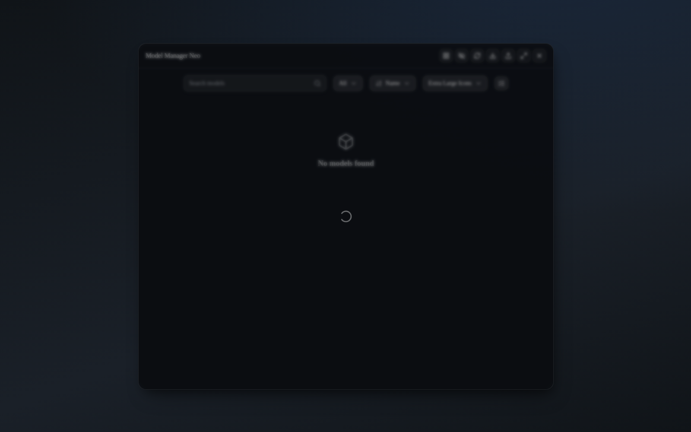

## 3. The two layouts

Switch with the first header button (grid ⇄ folder icon), or preselect the
default in **Settings → Model Manager Neo → UI → Flat Layout**.

### Flat layout

A single grid of every model of every type, with a toolbar:

- **Search** — multi‑token “AND” matching; `*` works as a wildcard
  (`*anime*` matches anything containing `anime`). Tokens match the file name
  _or_ the sub‑folder.
- **Type filter** — `All` or one model type.
- **Sort** — Name / Largest / Latest created / Latest modified / Recently
  used (opening a model or adding it to the graph records the use).
- **Card size** — Extra Large / Large / Medium / Small, or **Custom Size**
  (a dialog with width/height sliders, persisted in ComfyUI settings).

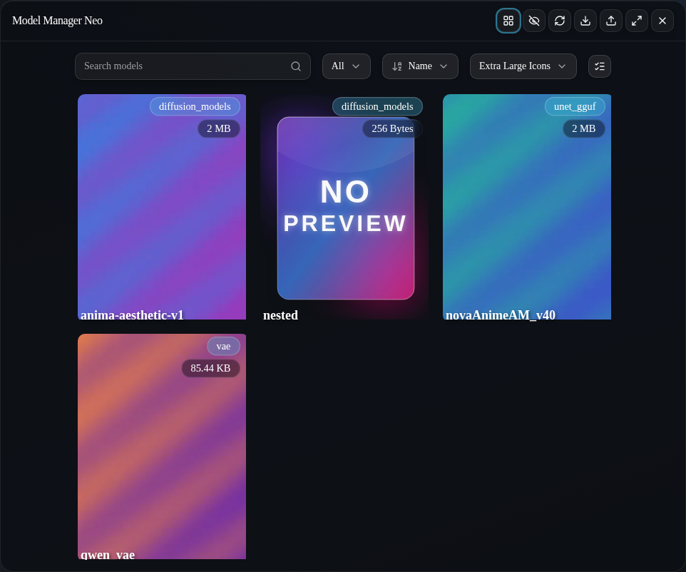

### Folder layout

A file‑manager style tree with a breadcrumb trail (each crumb carries a folder
glyph). The trail reserves nothing at the root - it opens up only as the path
gets deeper. Double‑click a folder to enter it, use the breadcrumb or the ↑
button to go back. Right‑click a model for the context menu (**Open**). The trail
always keeps the folder you are in readable: intermediate crumbs ellipsise
first as the window narrows, and in narrow windows the toolbar stacks
vertically — the same responsive rule as the flat view — instead of clipping
its controls away.

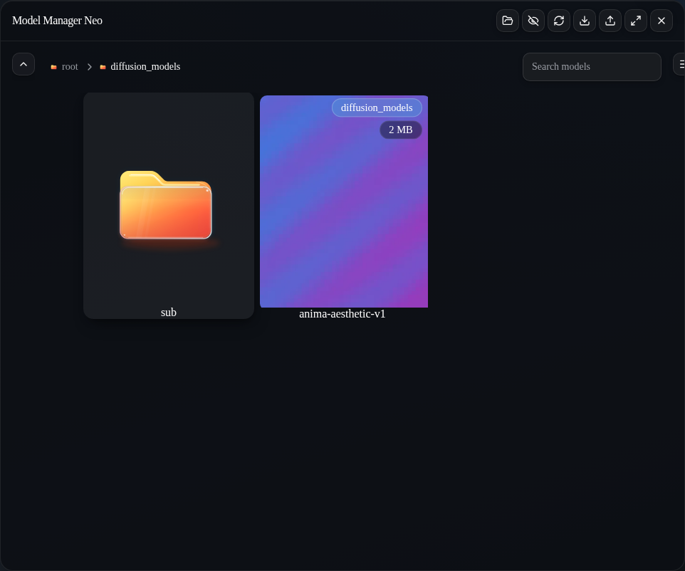

The row next to the search box offers **Add Folder** (folder‑plus icon): type
any name and the folder is created inside the directory you are browsing
(names ending in `_ZNN` / `_DeltaZNN` are reserved for ZipNN). Next to the
search box you also find the **sort order** and **card size** selects: the
folder view is designed as "the flat view scoped to one folder, plus the
folder-only extras (parent navigation, folder creation, folder compression)",
so model cards look and behave identically in both layouts — including the
hover column with add-node / copy / workflow / model-page buttons.

Both layouts share the **show/hide hidden files** header button (files and
folders whose name starts with `.`).

## 4. Model cards


- **Preview** — image or looping video; models without a preview show the glass
  **NO PREVIEW** artwork.
- **Chips** (bottom right) — model type and file size, scaled with the card.
- **Star toggle** (top right, on every card) — an outline star when unstarred,
  a filled yellow star when starred; clicking toggles it, and starred
  models/folders always sort first.
- **ZipNN corner button** (top right, next to the star) — the ZipNN artwork: one click compresses
  (or decompresses, shown inverted) with the same confirmation and progress as
  the detail-window button; on folder cards it runs the folder batch.
- **Folder cards** — a hand‑drawn glass folder that opens after the pointer
  rests on it for a second and closes a second after it leaves. Type‑root
  cards also carry the **aggregate size of their model type**.
- **Duplicate warning** — a model whose recorded SHA256 matches another file in
  the library shows a red alert with the duplicate's path in the detail window.
- **Smart collections** (flat view) — the _save search_ button sits in the
  slack before the collection select (dimmed, brightens on hover so it reads
  as a button); save the current search + type filter as
  a named collection (persisted per user) and re‑apply it from the collections
  select; the active collection shows as a chip with clear / delete buttons.
- **Hygiene scan** (both toolbars) — a local‑only sweep (no network, no
  hashing) listing orphaned preview / notes files, models without any preview
  (with a shortcut into their editor) and empty folders; selected entries are
  removed through the usual Danger confirmation.
- **Hover actions** (flat layout, large cards) — **Add node**, **Copy node**,
  **Load workflow from preview**, **Open model page** (the button wears the
  source platform's logo as its background when the platform is known).
- **Drag to the graph** — drag any card onto the canvas:
  - onto empty canvas: creates the matching loader node with the model selected
  - onto an existing node: fills the matching combo input
  - an _embedding_ dragged onto a text area appends `(embedding:name:1.0)`
  - dragging a **preview image** loads a workflow embedded in it
- **Double‑click / single click** — opens the model detail window.
- **Tooltip** — hovering a card shows its absolute path.

## 5. Model detail & editing

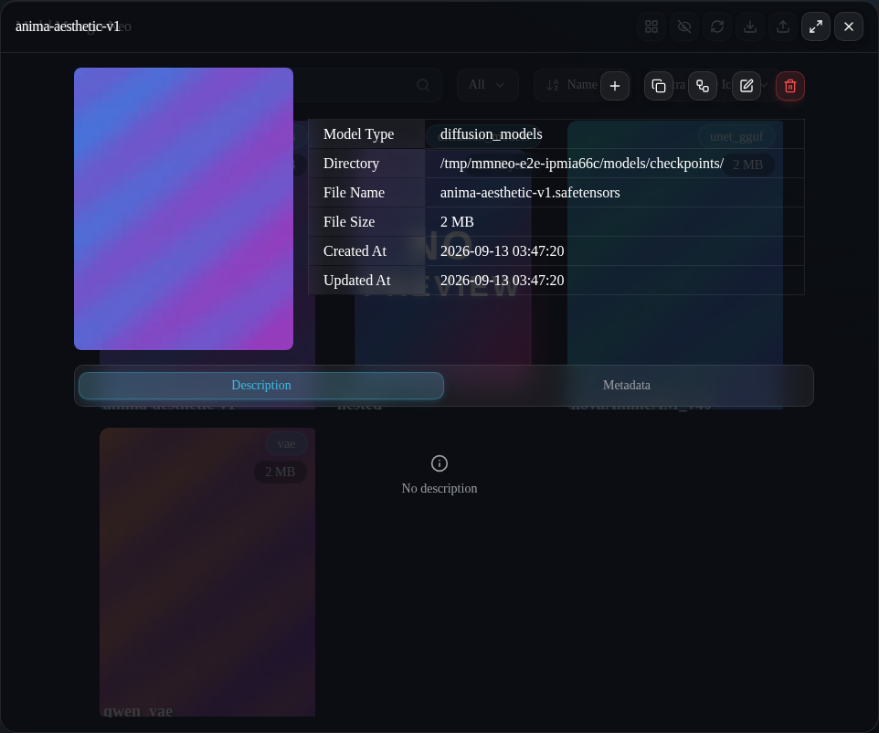

The window shows the preview (with a carousel when several previews exist), a
base‑info table, and two tabs.

| Row                                 | Meaning                                                                |
| ----------------------------------- | ---------------------------------------------------------------------- |
| Model Type                          | the ComfyUI model folder group                                         |
| **Directory**                       | the absolute directory **with a trailing `/`** — e.g. `…/models/unet/` |
| File Name                           | name without extension                                                 |
| File Size / Created At / Updated At | filesystem facts                                                       |

### Reading

- **Description** tab — rendered Markdown stored in a `*.md` file next to the
  model. Links open in a new tab.
- **Information** tab — a table of everything recorded about the (read‑only by
  default; in edit mode the pencil opens it **behind a warning**, and saving
  the form rewrites the notes' front‑matter)
  model. The YAML front‑matter of the notes (what Civitai / HuggingFace
  downloads write) is parsed into rows: author, base model, every file hash
  (`AutoV1` … `SHA256_12`), format and precision, the model platform, a
  clickable model‑page link and the URLs of **all** preview images; keys the
  parser does not know are listed verbatim at the end of the table. Models
  without front‑matter show the `__metadata__` block read straight from the
  safetensors header, verbatim (nothing is cached or scanned in the
  background). Safetensors models additionally get a **Tensor** section: the
  exact tensor layout parsed from the safetensors header, rendered like
  Hugging Face's safetensors viewer as a **folder tree**: dotted tensor names
  are grouped per segment, each folder row carries a folder icon that
  collapses / expands that level (everything starts maximally collapsed) plus
  its tensor / parameter count, and leaf rows keep name tail / dtype / shape;
  very large nodes page their leaves with an explicit _show all_ action. The **Open model page** button in the action row — like its
  twin in the card hover column — wears the logo of the source hub (Civitai
  or Hugging Face) as its background whenever the notes record the platform.

### Editing

Press the **pencil** to enter edit mode (the window turns into a form):

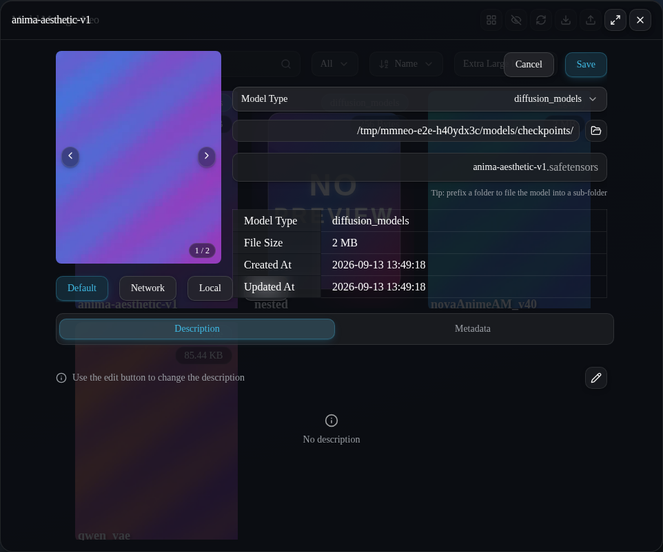

- **Model Type** — dropdown of the types your ComfyUI actually has folders for.
- **Directory** — read‑only field plus the **folder button**, which opens a
  nested folder‑picker dialog with a tree of every base path and sub‑folder:

  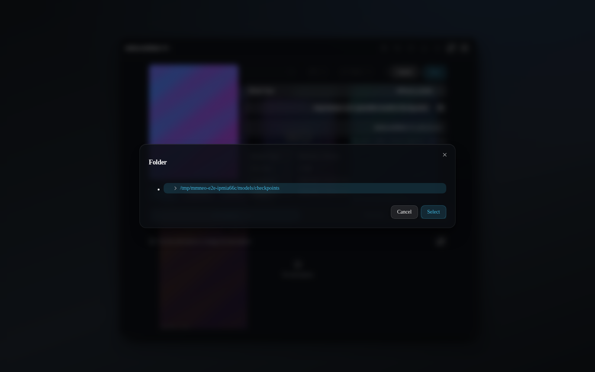

- **File name** — accepts a **folder prefix**. Typing
  `subfolder/my-model` files the model into `…/models/unet/subfolder/` on save
  (missing folders are created). `\ : * ? " < > |` and empty / `.` / `..`
  segments are rejected, and the backend re‑checks path traversal server‑side.
- **Preview** — `Default` (carousel) / `Network` (paste an image or video URL) /
  `Local` (drag & drop or pick a file; images are converted to WebP, videos keep
  their format) / `None` (removes every preview file). In edit mode a
  thumbnail strip manages the gallery: pick the primary, move entries left /
  right, or remove single images. The page left open on save becomes the
  card's **primary** preview.
- **Description** — press the **Edit (pencil) icon** next to the hint text to
  open the Markdown textarea; it saves when the textarea loses focus:

  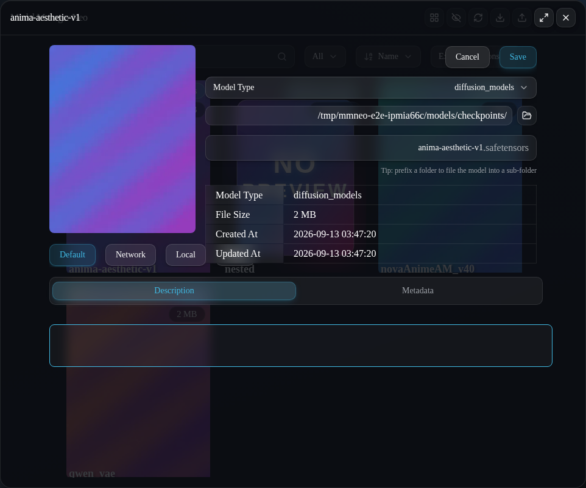

- **Save / Cancel** — Save issues a single `PUT`; anything that changed
  (name, type, directory, preview, description) is applied atomically per field.
- **Delete** (red trash) — removes the model **and** its previews and notes
  after a confirmation dialog.

## 6. Downloading models

Open **Download List** from the header, then:

### Create Download Task

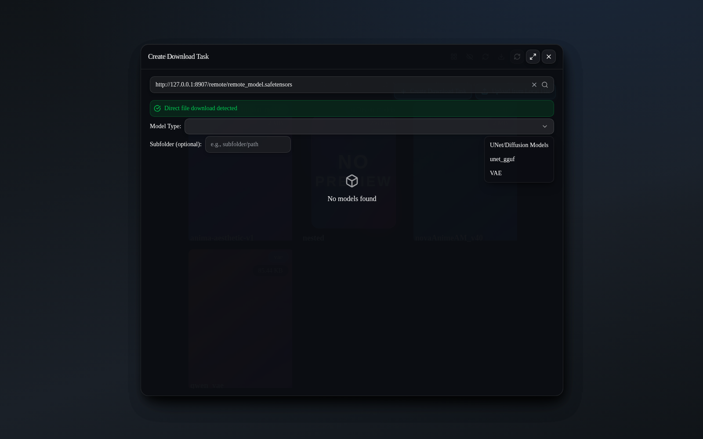

1. Paste a **Civitai model page**, **HuggingFace repo/blob/tree**,
   **ModelScope model page** (`www.modelscope.ai`) or a **direct file link** (`.safetensors`, `.ckpt`, `.gguf`, …) and press **Enter** or the
   search icon.
2. For a direct link you must pick the **Model Type** first (only types your
   ComfyUI has are offered); an optional **Subfolder** field lets you place the
   file deeper.
3. Civitai/HF pages resolve to one or more **versions** and **files**; pick the
   version in the toolbar and the file in the editor.

   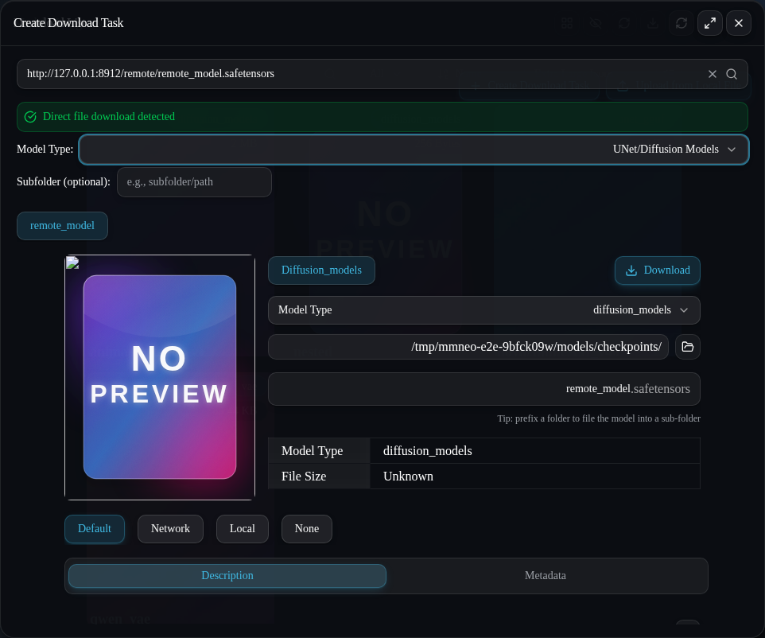

   The editor below the version row is a single scrolling column (gallery on
   top, file pick + download, metadata editor and the description /
   information tabs beneath), so nothing can be squeezed out of sight no
   matter how narrow the window is.

4. In the editor you can set the destination type/directory, a file name
   (folder prefixes allowed), the preview images — the **whole gallery** the
   model page offers is kept, and the image left selected in the carousel
   becomes the card's primary preview — and a Markdown description (Civitai/HF
   descriptions are pre‑filled, including trigger words and YAML metadata).
5. **Download** starts a background task. The previews are fetched in the
   browser when possible and server‑side otherwise; if both fail the model
   still downloads, just without a preview. The dialog shows the **free space**
   of the target volume and warns (and the backend refuses) when the file
   cannot fit.

### Download List

Two sections — **External Downloads** and **Local Uploads** — each row showing a
preview thumbnail, progress bar, transferred/total size and speed, with
**pause / resume / delete** controls. Deleting removes the partial file and the
task bookkeeping. Paused downloads resume with an HTTP `Range` request.

> Progress, pause and completion survive closing the window: tasks live in the
> backend and are pushed over the websocket.

## 7. Uploading to HuggingFace

The form carries a **provider switch** (Hugging Face / ModelScope). ModelScope
uploads always talk to the international `www.modelscope.ai` domain; repository
creation (public/private), destination path and the live progress read-out work
for both providers, and the folder-view batch upload (selected folders → every
model inside, sub-folders preserved) honours the chosen provider too.

Set your token first: **Settings → Model Manager Neo → API Key → HuggingFace
API Key** (or export `HF_TOKEN`).

Open **Upload to HuggingFace** from the header:

1. **Select model type** — a button per type.
2. **Select model** — the grid of that type; picking one pre‑fills the
   destination path with the model’s relative path.
3. **Upload to HuggingFace**:

   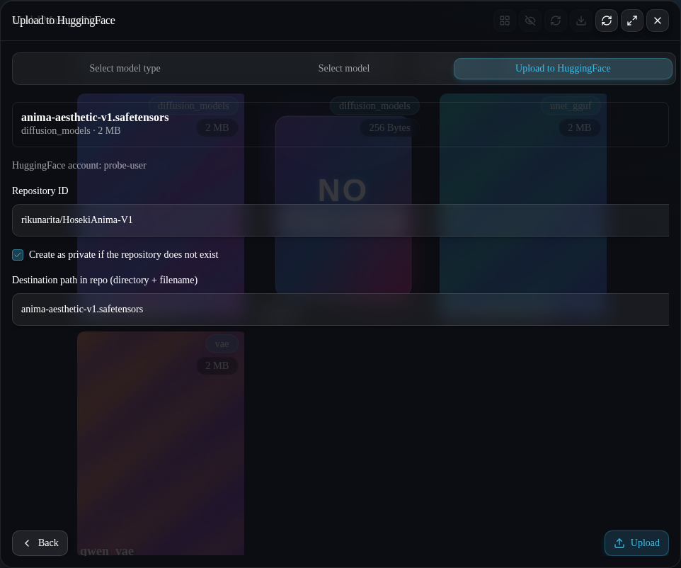

   - **Repository ID** — `username/repo-name`.
   - **Create as private if the repository does not exist** — applies _only on
     creation_; an existing repository keeps its own visibility.
   - **Destination path in repo** — directory + file name inside the repo.

Press **Upload**. The request returns immediately and the transfer runs in the
background, so closing the window never cancels it. The progress read‑out names
the current phase:

| Phase        | What happens                                                                                          |
| ------------ | ----------------------------------------------------------------------------------------------------- |
| `Preparing…` | token check, repository lookup, pre‑upload negotiation                                                |
| `Hashing…`   | the local sha256 is computed (a multi‑GB model can take minutes); **no bytes leave your machine yet** |
| `Uploading…` | the real transfer, with live percentages                                                              |

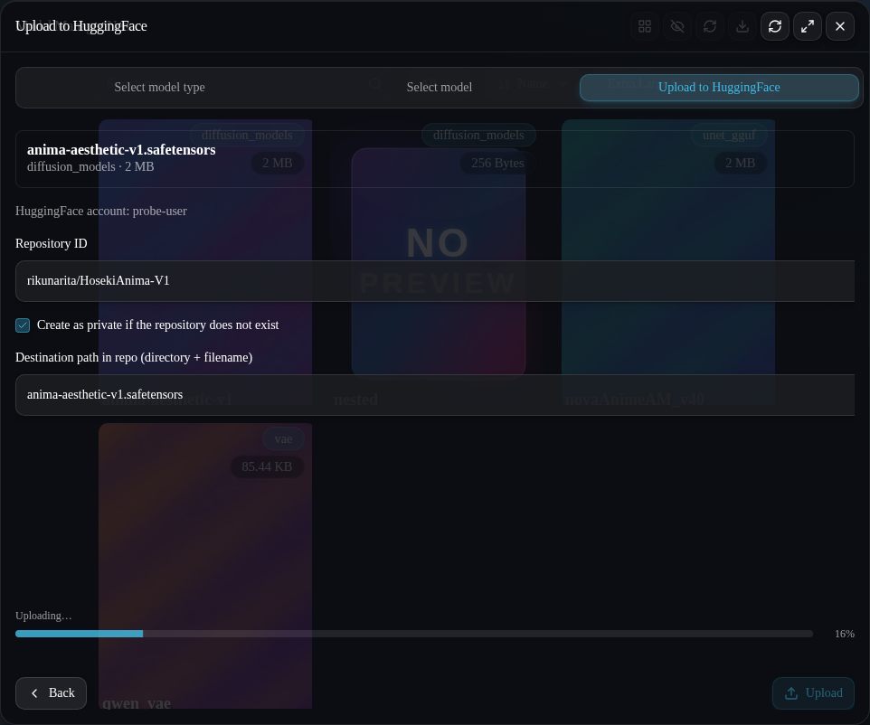

### Messages you may see on completion

| Toast                                                               | Meaning                                                                                                                                                                                                     |
| ------------------------------------------------------------------- | ----------------------------------------------------------------------------------------------------------------------------------------------------------------------------------------------------------- |
| **Success** — `path -> repo`                                        | a new commit was created and bytes were transferred                                                                                                                                                         |
| **Already stored on HuggingFace**                                   | the identical bytes already existed in the repository’s object store, so HuggingFace transferred nothing (`Upload 0 LFS files`) but a new commit pointing at them **was** created; the toast links the file |
| **Skipped** — “An identical file already exists in 'repo': <url> …” | the very same file already sits at that exact path; HuggingFace refuses empty commits, so nothing was done. Pick another destination path to create a new commit                                            |
| **Error**                                                           | the transfer failed; the message carries the backend reason                                                                                                                                                 |

## 8. Upload from a local file

**Download List → Upload from Local File**:

1. pick a model type,
2. pick a folder (or sub‑folder) in the tree,
3. choose the file.

The upload is registered as a **local task** in the Download List with accurate
progress and completes into the chosen folder. The destination is validated
server‑side (no arbitrary writes, no path traversal).

## 9. Feedback, galleries and the lightbox

- **Toasts.** Every action reports its outcome: success (green), warning
  (amber), error (red), info (accent). Each toast carries a severity icon, a
  tinted left bar, and a **close button** in its top-right corner; they stack at
  the top-right above every dialog and auto-dismiss after their lifetime.
  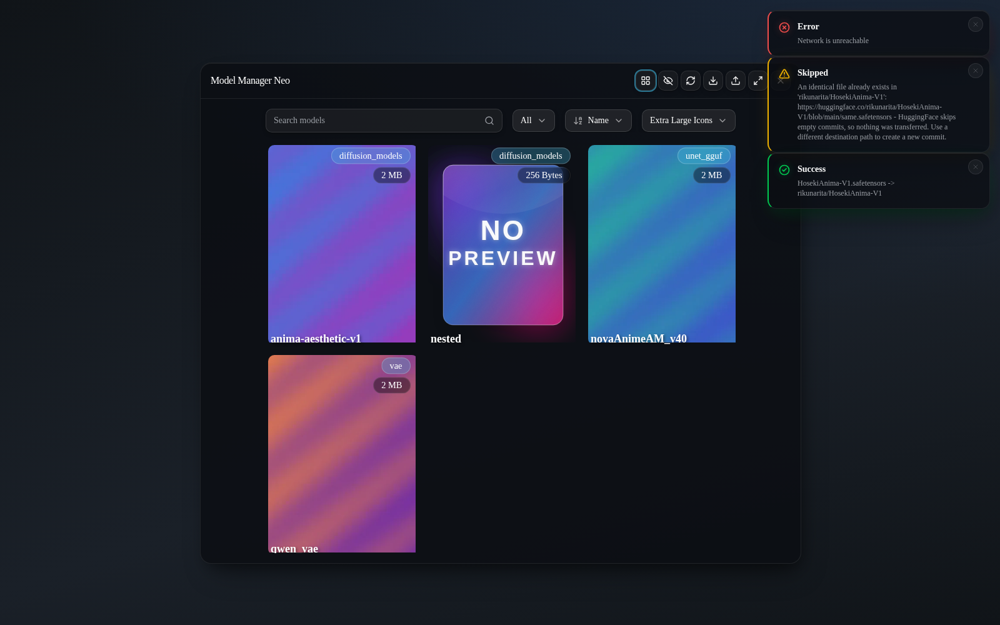
- **All previews are kept.** Downloads and saves store every preview image of a
  model (`<name>.webp`, `<name>.preview.webp`, `<name>.preview2.webp`, …).
- **Paging.** When a model has more than one preview, the preview area shows
  **`<` / `>` buttons** and an `i / n` counter, in view mode and in edit mode.
- **Lightbox.** Clicking (tapping) the preview opens it full-screen; `<` / `>`
  or the arrow keys page through the gallery, `Esc`, the backdrop or the close
  button dismiss it.
  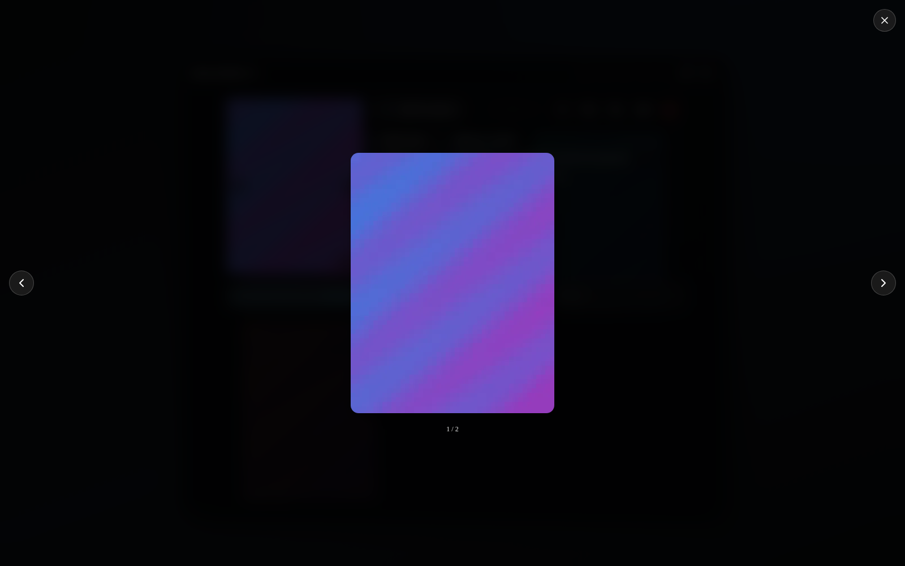
- **Environment keys.** If `private.key` is empty and `HF_TOKEN` /
  `CIVITAI_API_KEY` are exported, those keys are adopted into `private.key`
  automatically (only the ones actually present).
- **Oversized uploads.** A file above your ComfyUI server's upload limit
  (`--max-upload-size`, default 100 MB) is reported with a toast explaining
  exactly how to raise the limit, instead of a bare "HTTP 413".

## 10. Multi-select and ZipNN compression

### Select files

The toolbar of both layouts has a **Select files** toggle (list-checks icon).
While it is on, every card and folder shows a round checkbox at its top-left;
clicking a card ticks it instead of opening it. As soon as one item is
selected a bulk bar appears at the bottom of the window:

- **Add to workflow** — creates one loader node per selected model; selected
  _folders_ contribute every model inside them (recursively);
- **Delete** — deletes every selected model after a Danger confirmation
  (previews and notes included); selected _folders_ are removed recursively;
- **ZipNN batch** (folders selected) — the ZipNN artwork button: batch
  compress / decompress the selected folders (see below);
- **ZipNN delta compress** (exactly two plain models selected) — opens the
  base/fine-tune picker (see below);
- **Upload to HuggingFace** (folders selected) — batch‑uploads every model
  inside the selected folders (sub‑folders preserved) through the same upload
  dialog;
- **Star** (folders selected, icon only) — yellow when every selected folder
  is starred (pressing unstars them all); otherwise it stars exactly the
  unstarred ones;
- **Clear selection** — unticks everything. Leaving the mode also clears it.

ZipNN bundle folders (`*_DeltaZNN`, legacy `*_ZNN`) and ordinary folders can never be selected at
the same time: adding one kind while the other is ticked deselects the bundle
folders and shows a warning toast.

### ZipNN compression

Opening a `.safetensors` model shows the **ZipNN artwork itself as the button**
in the gap between the preview and the info table: the shipped SVG draws its own
glass plate (including a dark-mode variant), lifts and brightens on hover, and
explains itself in a tooltip and to screen readers. Pressing it asks for a
confirmation that is deliberately _not_ styled as Danger, then compresses
tensor-by-tensor in the background:

- the button is replaced by a **progress bar** while the task runs;
- on success the original file is replaced by `<name>.znn.safetensors`;
  previews and notes follow the rename, and the grid refreshes by itself;
- opening a compressed model shows the same button with **inverted colours**
  and the label **ZipNN decompress**; pressing it confirms and restores the
  plain `.safetensors` file.

For a compressed model the info table also swaps its single _File Size_ row for
**Original File Size** / **Compressed File Size** / **% of Original Size** (the
pre-compression size is recorded in the file's metadata at compression time).

Compressed files follow the official ZipNN layout (`znn_compressed_vectors`
metadata, Huffman-compressed floating-point tensors), so loaders patched with
`zipnn_safetensors()` read them transparently. Compression is **lossless and
reversible**: the plain `.safetensors` is only removed after the
`.znn.safetensors` file has been fully written, and a failed run cleans up its
partial output.

**No installation step.** ZipNN is _vendored_ inside the extension
([`third_party/`](../third_party/)), together with **prebuilt `zipnn_core`
binaries** for Linux x86_64 (CPython 3.10–3.14). On those platforms the first
compression simply puts the bundled package and the matching binary on the
import path — **no `pip install`, no C compiler, no network, no waiting**. Only
where no prebuilt binary matches the platform/Python (macOS, Windows, an
uncommon architecture, or a brand-new CPython) does Neo build the C core **once**
from the bundled sources, which needs a C compiler and the Python headers
(`Python.h`). If that fallback build fails, the error toast shows the first
interesting line (the full output stays in the ComfyUI console), names the
missing prerequisite together with the distro-specific command that fixes it,
and offers a **retry** action. To choose the compiler yourself for that build,
export `CC=/path/to/gcc` before starting ComfyUI. See
[`third_party/README.md`](../third_party/README.md) for the platform/glibc
coverage and how to add binaries for other systems.

### ZipNN batch compression (folders)

Select one or more folders and press the **ZipNN artwork button** in the bulk
bar (or use the corner button on a folder card). After a confirmation, every
`.safetensors` model inside the folder tree is compressed — previews and notes
follow their models — and every compressed file is **moved into the bundle
folder `<name>_DeltaZNN`** (the original folder disappears once it empties).
Such a bundle folder is sealed: only ZipNN content (`*.znn.*` models, `*.znn`
delta files) can live inside it (uploads, downloads and moves of plain models
into it are refused). The bundle's ZipNN button is **inverted**; pressing it
**batch-decompresses** the bundle, moves everything back to the folder it was
named after and removes the emptied bundle folder. Delta folders
(`<base>_DeltaZNN`) are bundles as well — their inverted button restores every
fine-tune inside them. Model-type root folders (`checkpoints`, ...) get their
bundle **inside themselves** (`<root>_DeltaZNN`), because a sibling of a type
root would fall outside ComfyUI's folder mapping; their direction is
auto-detected: compress while plain models exist, decompress when only bundles
remain. Bundles created by older versions (`<name>_ZNN`) still decompress back
to their original name. While a task runs, the button shows a circular ring
with the percentage inside. Several folders run one after another behind a
single confirmation.

### ZipNN delta compression (fine-tunes)

Select exactly two plain `.safetensors` models (base + fine-tune) and press
**ZipNN delta compress**. A dialog asks which selection is the **base model**;
the other is the fine-tune. Confirming stores only the **difference** in
`<base>_DeltaZNN/<ft>_delta_<base>.znn` (usually a few percent of the
fine-tune's size) and removes the redundant fine-tune file. The delta's card
button (inverted artwork) restores the fine-tuned model **byte-exactly** next
to the base and deletes the delta folder once it empties. Restoring requires
the base model to still be present.

## 11. Settings

ComfyUI **Settings → Model Manager Neo**:

### API Key

- **HuggingFace API Key** / **Civitai API Key** — stored locally in
  `private.key` next to the extension (masked in the UI), with `HF_TOKEN` /
  `CIVITAI_API_KEY` as environment fallbacks. Keys saved in older versions’
  ComfyUI user settings are migrated automatically on first run.

### Model List

- **Exclude model types (separate with commas)** — hides those types from the
  grids and pickers.
- **Include hidden files (start with .)** — same as the toolbar eye button.

### UI

- **Card Size** / **Card Size Map** — persistence for the size picker (hidden
  entries; edit them through the Custom Size dialog).
- **Flat Layout** — default layout on open.
- **ZipNN → Auto‑compress unused days** — compress models untouched for N days
  (0 = off); **Auto‑compress on download** — compress right after a download
  completes; **Download → Pause during prompt** — hold transfers while ComfyUI
  executes a prompt and resume them afterwards.

## 12. Languages

The UI follows ComfyUI’s locale (**Settings → ComfyUI → Locale**) and ships
complete bundles for **English**, **中文** and **日本語**. Region/script
subtags (`ja-JP`, `zh-Hant-TW`, …) are folded onto their base language; anything
else falls back to English.

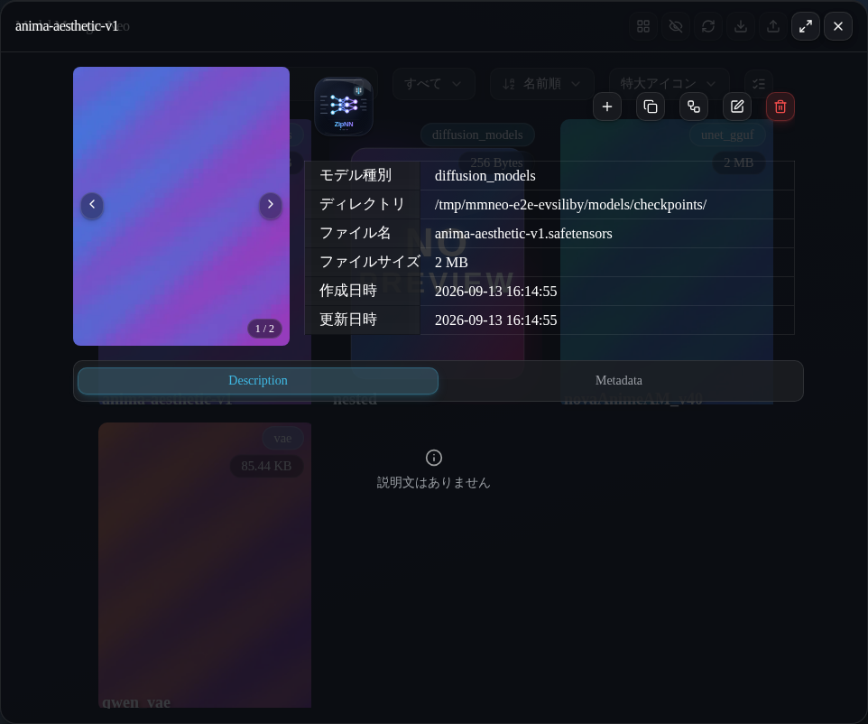

## 13. Troubleshooting

| Symptom                               | Cause / fix                                                                                                                                       |
| ------------------------------------- | ------------------------------------------------------------------------------------------------------------------------------------------------- |
| The manager button is missing         | the frontend did not register the extension — check the ComfyUI log for an import error, and that the folder is named `ComfyUI-Model-Manager-Neo` |
| `HuggingFace token not set`           | set the token in Settings (or `HF_TOKEN`) and reopen the dialog                                                                                   |
| A download never starts               | the URL may need authentication (Civitai gated models) — set the Civitai key; the task row shows the server’s error text                          |
| “Failed to update model: PathIndex …” | the selected type has no folder on this machine — pick a type from the dropdown                                                                   |
| The UI looks unstyled / grey boxes    | you are looking at a stale `web/` bundle; rebuild with `pnpm build` (only needed when developing)                                                 |
| Preview shows NO PREVIEW              | the model has no preview file; set one in edit mode                                                                                               |

## Screenshots

The images in this guide live in [`docs/screenshots/`](screenshots/). See
[`screenshots/README.md`](screenshots/README.md) for the full per-file manifest
and for how to (re)capture each view from a live ComfyUI window.
